# CDH

# 1 简介

```
#1，回忆手动搭建hadoop集群

1）准备
网络，主机名。时间，JDK，免密（两种：管理脚本）

2）手搭建HDFS为例：

#版本，模式：
	1.X 只能伪分布式，完全分布式。  
	2.X 可以模拟搭出之前的两种（之前操作是用2.X,向下兼容1.X），同时还有HA完全分布式

#HA: 依赖ZK,,内部jn: 同步NN的内存的，操作的日志。

#流程：
一台节点，配置书写完整，，然后分发。。

ZK先起来,,，
JNN先于格式化前 起来。。
一个NN，格式化，另一个同步，（先删干净，然后保证现有的集群 clusterID一致）
（现在其实可以启动完成集群搭建，只是没有自动切换）

现在自动要ZK，
ZKFC：一个单独进程（HDFS 向前兼容） 创建指定目录存

（NN有ZKFC，RM没有，，，因为NN比较早，然后为了不太修改原来的，就单独加个ZKFC，但是YARN，比较晚，已经出现了HA问题，所以，开发的时候，直接考虑到了，直接加到了RM一个模块）

------------------------------------

#Apache Hadoop 不足之处	
	版本管理混乱
	部署过程繁琐、升级过程复杂
	兼容性差
	安全性低
#由此可以看出如果一个个手动搭建集群，非常麻烦，同时出错的话，也很麻烦
```


```
#2，CDH简介

1) 介绍
Cloudera’s Distribution Including Apache Hadoop（CDH） 是个hadoop的发行版
#CDH也就是个安装包 （发行版：就是把东西整一起）

Cloudera 公司，把所有包弄在了一起，同时提供了WEB管理
	有 CDH（包） ，CM（管理） ， CMS（监控，独立的）
	
#Cloudera 属于直接开源hadoop的，使用和自己单独的一致。
#国内的是包装后的


2）CDH包： （我们用5.X，，比4好很多）
优点：
	版本划分清晰
	版本更新速度快
	支持Kerberos安全认证
	文档清晰
	支持多种安装方式：
		Cloudera Manager  （联网或者本地放CDH，然后全节点有，CM再去管理）
		Yum
		Rpm
		Tarball （tar 压缩包）

包大致内容：
#impala: 完全基于内存计算，，比hive快
#spark：  是内存迭代计算 （比mr快），还有磁盘
```


[CMH 5.4]: http://archive.cloudera.com/cdh5/
[CM 5.4.3]: http://www.cloudera.com/downloads/manager/5-4-3.html


# 2 CM

## 2.1 简介 与 架构

```
#1，简介
Cloudera Manager是一个管理CDH的端到端的应用
#作用：管理，监控，诊断，集成
#（现在安装管问题，，后面管运行时候问题）

三大东西：
#CDH 光盘安装程序：（单个安装包不用再自己编译混乱 和 用各个东西版本最好的组合）
#CM管理，，，安装   （所有节点先有CDH，被CM操作）
#CMS 分析  （应用层到硬件层  都监控）

web CM展示
```


------


```
#2，架构
主从： Server（入口） –> Agent（节点）
	左边客户端，下边核心结构，
	外边：（右边都是s的一个服务）
		上面是存CDH的多种仓库，
		DB：节点规划，存信息的
		CMS是独立的监控服务

-----------------

其他知识：
#CMS  ：官方推荐64G  
（内存小，就先把东西存到磁盘，，然后反复IO，所以就慢了）
（独立，有没有对CDH都没有影响）

##sql软件：
存 不同部门，和不同软件 的东西用 库来区分

----------------

流程：
#C端发送下载组件指令，，Server先去仓库下载CDH，然后分发CDH，，然后再组件规划

（如果S直接有CDH，不用联网去下载，所以可以人为自己存一份，，再分发其他节点）
```


## 2.2 部署

### 1）准备

```
#1，虚拟机准备
选用三台机子（一个是S/A，，另外都是A）

1）快照  三个，转到最原始状态。

2)想要给虚拟机预留内存  ：
#首先项->内存 不能太大超过提示

3) node1,node2,node3 的具体配置 

S/A   A   A   （CPU 都给个两核）
10   2    2      (16G用这个，一下配置都是16)
#6    2    2     （8G，也能操作，就是卡）
#磁盘要留个30G以上，（先开机的时候会开启一定大小来占位，后面虚拟机内存不够会扩展都到磁盘）

4）Xshell登录，，手动登录输入的那种方式
```


```
#2，系统环境准备

1）网络配置
vi /etc/sysconfig/network    （上网的）
vi /etc/hosts				（主机名）

2）防火墙关闭
service iptables stop
chkconfig iptables off

3）SELINUX关闭
setenforce 0
vi /etc/selinux/config (SELINUX=disabled)

#上面的都是已经linux最初始化弄好的
-----------------

4）SSH免密钥登录  (用rsa方式)
ssh locolhost   (创建目录.shh)

ssh-keygen -t rsa -P '' -f ~/.ssh/id_rsa
(集体会话：在.ssh目录 下创建自己的公钥 )

ssh-copy-id  node1
scp authorized_keys nodeX:`pwd`
（三节点弄到同一节点上，然后node1分发给其他）

5) 安装JDK配置环境变量
rpm -i  jdk*   (linux 扩展)

export JAVA_HOME=/usr/java//jdk1.7.0_67
export PATH=$JAVA_HOME/bin:$PATH
export CLASSPATH=.:$JAVA_HOME/lib/dt.jar:$JAVA_HOME/lib/tools.jar

6）安装NTP
yum  install ntp -y
ntpdate ntp1.aliyun.com
	#设置开机启动 chkconfig ntpd on

7)mysql  (安装一个就行，在server上，大内存)

node 1 ：yum install mysql-server
service mysqld start
mysql 

mysql 内：
use mysql;
delete from user;

GRANT ALL PRIVILEGES ON *.* TO 'root'@'%' IDENTIFIED BY '123456' WITH GRANT OPTION; 
flush privileges;

#修改 密码 mysqladmin -ujx -pjx password 123456
#让以后再任何节点，，，能够以用户密码登录，，具有任意权限同时还可以赋予权限

8）下载第三方依赖包
三节点：
yum install -y chkconfig python bind-utils psmisc libxslt zlib sqlite cyrus-sasl-plain cyrus-sasl-gssapi fuse fuse-libs redhat-lsb

#只有第七步，是只在一个节点上
```


### 2）CM


```
#1，部署

#cm 情况

1）所有节点安装Cloudera Manager Server、Agent 

mkdir /opt/cloudera-manager （所有）

tar xf cloudera-manager*.tar.gz -C /opt/cloudera-manager

#参数
xf  -C：最简单方式了（如果有v 还会显示过程，这时候虚拟机还要给shell输出回来)

-----------------------

2）配置CM Agent （去标识agent，让a能找到s）

修改文件/opt/cloudera-manager/cm-5.4.3/etc/cloudera-scm-agent/config.ini中server_host=node1

#agent节点自己去标识自己


#效果：
每个节点在该CM目录下，都有 cloudera 和 cm 两大部分
```


```
#用户资源
3）创建用户cloudera-scm

useradd --system --no-create-home --shell=/bin/false --comment "Cloudera SCM User" cloudera-scm


#是指，创个用户 但是没家目录，无解释器    
---> 创建后台用户（就是不能登录）。

-----------------------

4）创建Parcel目录    （存放cdh包的）

#Server节点
mkdir -p /opt/cloudera/parcel-repo
chown cloudera-scm:cloudera-scm /opt/cloudera/parcel-repo

#Agent节点 (所有)
mkdir -p /opt/cloudera/parcels
chown cloudera-scm:cloudera-scm /opt/cloudera/parcels


#三位一体：ps -fe（查看属于谁）
是资源，当你用户和资源绑定了，权限就出来了
（进程 和目录 都属于这个用户，真正的全方位一体，， 保护了其他用户和进程不能修改这个）

#效果：
```


```
5）配置CM Server数据库

拷贝mysql jar文件到目录 /usr/share/java/
注意jar包名称要修改为mysql-connector-java.jar

在mysql 内：(创个用户)
grant all on *.* to 'jx'@'%' identified by '123456' with grant option;
cd /opt/cloudera-manager/cm-5.4.3/share/cmf/schema/
./scm_prepare_database.sh mysql temp -h node1 -ujx -p123456 --scm-host node1 scm scm scm
（格式：数据库类型、数据库、数据库服务器、用户名、密码、cm server服务器）

#效果：帮你创建好用户，以及数据库 
All done, your SCM database is configured correctly!
```


```
6 ) 制作CDH本地源

1G : 包
json: 所有包版本下的组件名称
找到json对应包版本下的hash,,写成.sha，用来看文件完整性的
```


```
7) 启动： （启动前一定要把之前的 CM目录下两个文件分发给其他agent ）

#先分发：
scp -r ./*  root@node3:`pwd` 1>  /dev/null  (1 表示正确的不看)

#如果失败卡死：
	ctrl c 退不出来，，ctrl z 放到后台
	jobs    -l    详细看后台任务包括PID ，然后kill -9 
#du -sh    . / 总共   ./ *  单独   ：统计文件大小来看看对不对 （这里大小不一，因为后面去掉了连接）

--------------------------

#启动CM Server、Agent   （真正是就只配置启动个S，然后web勾选A，让CM自己操作）

cd /opt/cloudera-manager/cm-5.4.3/etc/init.d/       （这是模仿linux系统的etc/init.d）

./cloudera-scm-server start  
（Sever首次启动会自动创建表以及数据，不要立即关闭或重启，OK，还不代表好，否则需要删除所有表及数据重新安装）

/opt/cloudera-manager/cm-5.4.3/etc/init.d/cloudera-scm-agent start  （所有）


#日志在cm/log ： tail -f cloudera-scm-server/cloudera-scm-server.log

效果：日志出现端口，就行了  7180  （如果出现错误，删数据库东西，再重来）
http://node1:7180
	用户名、密码：admin

图：
#如果是英文：换谷歌 和 火狐 然后看看本地linux 的$Lang
```

图1-1

### 3）web 

#### --完善Cloudera集群

```
#1，完善集群  ：选两步
#选免费的，，然后选之前配置的主机  1-2

#之所以能看到管理的主机，是因为安装和配置好了，可以不用自己配。用web配。   1-3
```

图1-2

图1-3


```
#2，CDH 分发：选三步

在之前先看一下Main服务所占端口 （随机占用）
	netstat -natp | grep XXXX
	别拿特定端口了50070 和yarn 8088
	#不然后面大数据集群起不来。
 
1）选择我们的对应版本    2-1

2） 分发 ：中间漫长等待过程	

#过程：（cache 是包，，然后释放个CDH目录，在parcel）
在cloudera目录下，多了个cache目录（用来接收S发的CDH包），然后agent 的cloudera/的parcel 一开始没有东西，，然后cache释放CDH。

#结构：CDH包
bin ：里面有所有大数据组件的命令  
	
	#关心这两个：jar（可以手工找）和 etc（web）
jar : 很多又混乱  统计个数： ll | wc -l
	去lib下：整齐的jar ，例如 hadoop 里面就是像之前一个单独的结构了
	
etc ： 配置是分开存的
	这个不自己找，，可以web找


3） 检查错误           2-2
	按照提示修改  （我这里是修改下参数）
```

图2-1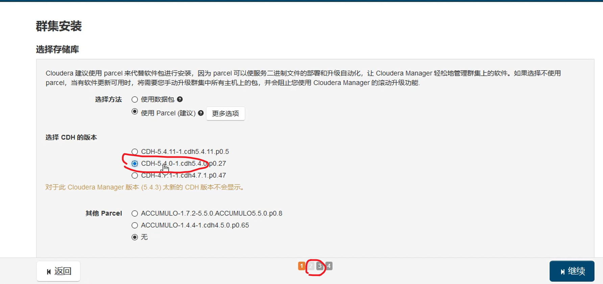

图2-2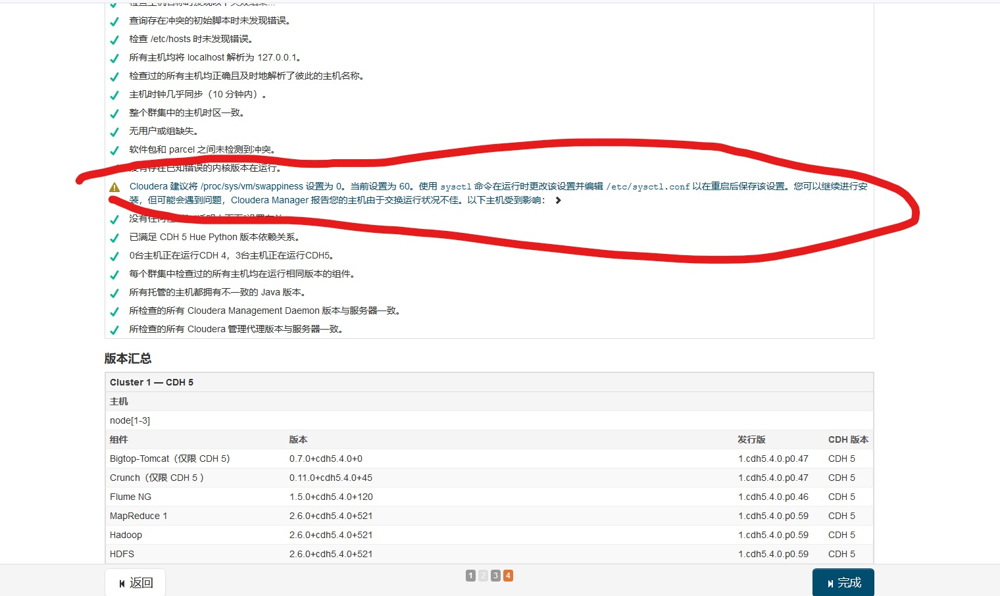

------


#### --搭建大数据集群

```
1）选要的大数据服务
选HDFS，YARN是指2.X，ZK（还自动安装了CMS）
#MR是指1.X ，YARN 直接包含了 2.X的MR
```


```
2）选择角色分配
#选了选的是2.X，但是目前还是非HA。
#后面可以手动开启KA
```

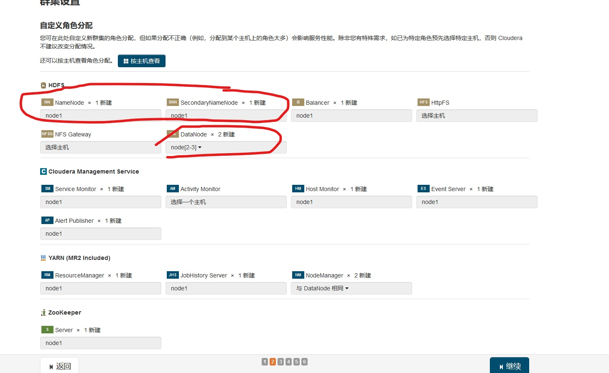

```
3）一些设置
#不用操作先，可以看下帮助介绍

4）启动集群
#我自己只出现超时的问题，简单重试就行
#最有可能问题是： 之前没注意main 的随机端口

步骤：
先停止，然后删除大数据服务集群
删除hdfs的目录（因为格式化了，后面会出错）
重启CDH集群，然后回到图1-3，在分发前，先检查。

#VM占用bug：之前占用的CDH不会被删除（除非是图形化操作系统，可以用VM tool）

```

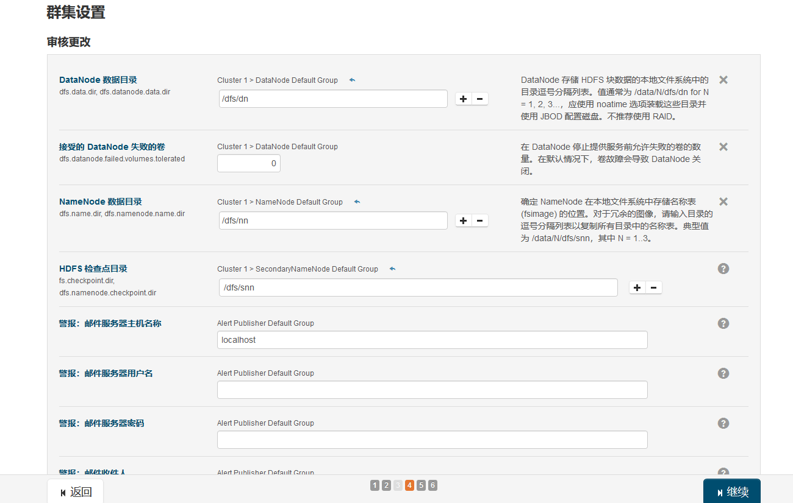

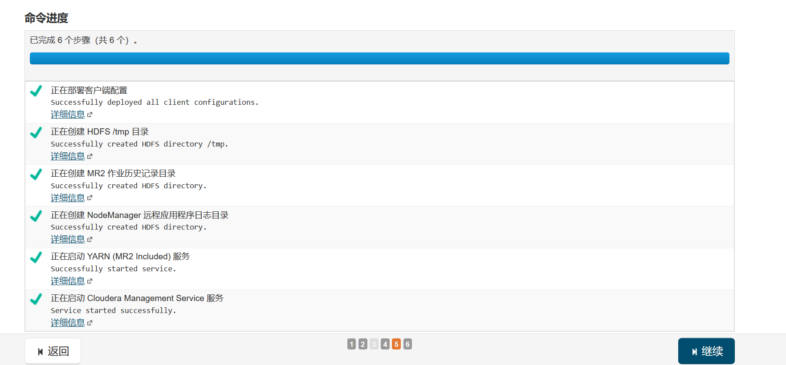


```
以进入这个CM 界面，，，以及 大数据web ，表明  cloudera 和 大数据集群  都启动完毕
```

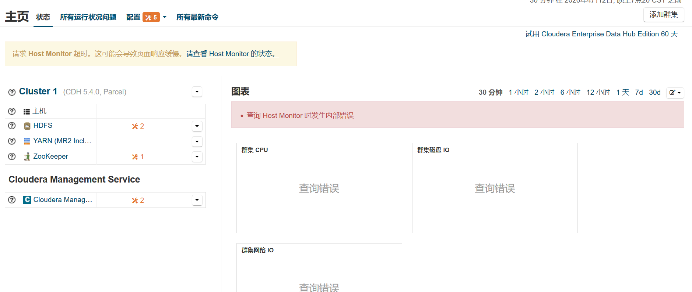

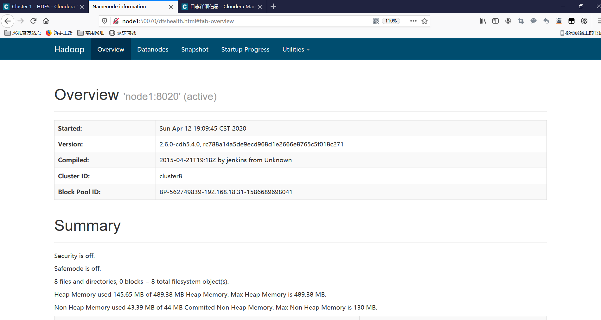

------

------

## 2.3 CM 使用

### 1）启动关闭

```
数据库服务要先启动

#1，开启  WEB慢等等
1）cdh：
/opt/cloudera-manager/cm-5.4.3/etc/init.d/cloudera-scm-server start

(所有agent)
/opt/cloudera-manager/cm-5.4.3/etc/init.d/cloudera-scm-agent start

2) 集群：（在WEB操作）
先点开 启动集群
然后点 CMS

#2，关闭：
1）集群：
先关闭集群，

2）CDH：
（所有）
/opt/cloudera-manager/cm-5.4.3/etc/init.d/cloudera-scm-agent hard_stop_confirmed (stop不好用)

/opt/cloudera-manager/cm-5.4.3/etc/init.d/cloudera-scm-server stop
```

[完全关闭以及重启]: https://blog.csdn.net/u012071918/article/details/80599928


### 2）使用

```
#1，功能
管理监控集群主机。（CMS）
统一管理配置。    （找配置）
管理维护Hadoop平台系统。 （管理集群）

#2，名称规范
```

| 中文       | 英文                  | 介绍                                 |
| ---------- | --------------------- | ------------------------------------ |
| 主机       | host                  | 一台台物理服务器                     |
| 机架       | rack                  |                                      |
| 集群       | Cluster               | 指大数据逻辑集群 ： CM大集群的一部分 |
| 服务       | service               | 类似类，CHD中所有组件 hdfs, yarn,等  |
| 服务实例   | service instance      | 具体的一个对象                       |
| 角色       | role                  | 组件的所有角色                       |
| 角色实例   | role instance         | 组件的具体一个角色                   |
| 角色组     | role group            | 角色分组， 例如把从角色分一组        |
| 主机模板   | host template         |                                      |
| 包         | parcel                | agent存CDH的地方                     |
| 静态服务池 | static service pool   |                                      |
| 动态资源池 | dynamic resource pool |                                      |

```
#3，具体操作

0）主导航介绍
主机  ： 指所有主机
画图  ： 有画图  和 仪表盘
```


```
1）集群管理   （CM上主页上点）
	添加、删除集群
	启动、停止、重启集群
	重命名集群
	全体集群配置
	移动主机
```


```
2）主机管理   （上面主导显示，所有主机，下面二级导航显示一个集群的主机）
	查看主机详细
	主机检查
	集群添加主机
	分配机架
	主机模板   (在一个集群主机中，添加模板，加角色，然后新加主机的时候，给新主机用模板)
	维护模式
	删除主机
```

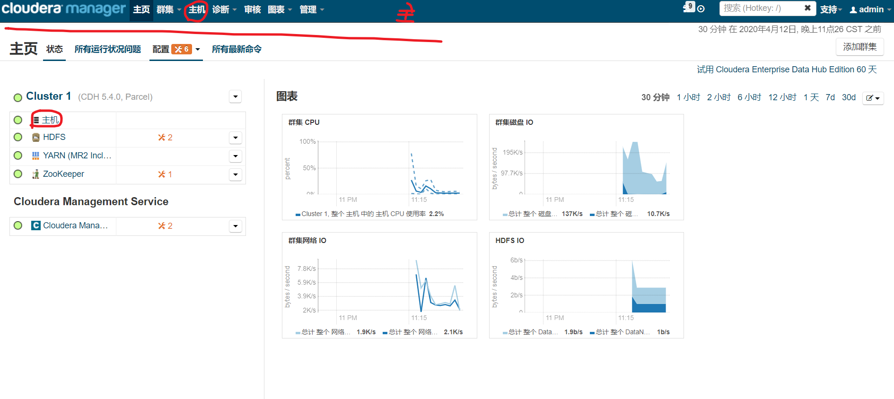


```
3）服务管理     （点集群的一个服务实例进去，， 有角色实例） ：启动高可用
	添加服务
	对比不同集群上的服务配置
	启动、停止、重启服务
	滚动重启
	终止客户端正在执行的命令
	删除服务
	重命名服务
	配置最大进程数 ：rlimit_fds

hdfs核心两个配置   core-site   hdfs-site  
Core-site 非HA，fs.defaultFS  只有一个节点名字。。如果HA：是集群名，然后再配多个主机名
# 连参数的时候，， hdfs://mycluster （保证  每次C连接的是主。）

操作：
#把服务配置下载回来


```


```
4）角色管理
角色实例
	添加角色实例
	启动、停止、重启角色实例
	解除授权
	重新授权
	删除角色实例
角色组
	创建角色组
	管理角色组
```


------

------

# 3 应用

## 3.1 hue

### 1）安装hive,ooize,hue

```
#1，先安装hive , ooize

1）hive
先建个数据库，给hive专门用的
create database hive     DEFAULT CHARACTER SET utf8;
grant all on hive.* TO 'hive'@'%' IDENTIFIED BY 'hive';
然后选服务安装。

2）oozie  工作流协调服务
一样
create database oozie     DEFAULT CHARACTER SET utf8;
grant all on oozie.* TO 'oozie'@'%' IDENTIFIED BY 'oozie';
然后选服务安装，选最多的那个。


#装完都启动

然后安装hue
```


```
#2，hue  （像是代理，，以及平台）

#浏览器<--->hue server （代理层，平台）<--->大数据服务(hue是实际客户端)
	hue 代理用户去操作，，东西实际都是属于用户的。
	浏览器返回的结果如果太大了，不能展示
	
#能把服务都图形化  （原生web： 2.X hdfs只能浏览目录 ,hive根本不用原来web）
	所完成的基本功能都不是hue写的，只是hue 把api 拿了出来，。
	创新的功能，，只是不修改原来的，然后包装了一下新的功能。
```


```
登录：

hdfs：有用户概念，，但没有用户系统这个概念
hue有了用户密码登录 ，hue 的用户名字而言，随便起，，这里hdfs  hdfs（正好与hdfs的用户一样）

讨论用户的概念：
#就hdfs组件而言
ps -fe | grep  XX  看进程属于啥的。（能看到属于hdfs用户）

这是管理平台CM弄得：   （CM一个服务，就以名字弄用户。）
#弄个普通用户hdfs，，让他绑定bin下的启动关闭绑定，谁启动角色进程，它就是hdfs 最大的用户
#其他的hive，，sqpark啥的    cat /etc/passwd 能看到一堆服务  和 用户 
```


### 2）操作hue

```
#2，操作
有文件系统，，job，，工作流，，SQL 和 查询   ，，，以及管理Hue用户，
```

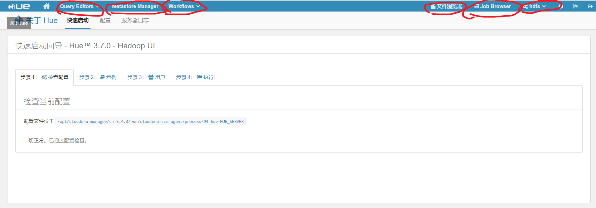

```
1）文件浏览器
你进hue，拿的hue的用户 hdfs，登录，，然后代理操作hdfs，东西还是用户的

#创建目录操作，属于hue用户的

#文件操作
	创建文件
	然后点击，就可以去编辑文件：
		#hdfs 不支持，随机修改，只能append
		#hue,能任意修改，，实际是新文件覆盖那个文件


实际：
浏览器<--->hue server （代理层，平台）<--->hdfs(hue是实际客户端)

#如果多个浏览器用户，，先验证hue，（uri-->api），然后hue开该用户进程，去开启hdfs 服务，实际上东西都是属于用户的。 然后结果 先传给hue，然后再浏览器

#还是本质，根本的知识点没破坏，，hdfs，你告诉我是谁，就是谁。
#浏览器返回的结果如果太大了，不能展示
```


```
2）job
3）工作流 ：串行，并行
	#原生是XML 文件配
```


```
4) query  和 Meta

​hive:  写  查看
#操作：
	建表（数据实际存在hdfs,,hbase中）
	元数据管理中load： 本机（这里用windows本机） 和hdfs  
    	#bealine   不支持本机load，，是把命令字符串给hs2了
		#hue 能本地，实际是，本机把东西也传给了hs2，包装了一下
	统计计数

​读：
操作：
	完整表数据：元数据管理
	进程：job

```


```
5）管理用户：  可以新增用户（创个root，好让主机，可以正确操作集群访问hdfs，赋成超级用户）
#hdfs 用户最大

文件管理系统的用户目录 是/user

#新增用户：创Hue的用户，，然后代理去操作集群 （勾个创建主目录，主目录也有家目录了），用用户进去，，是/user/XXX 这个目录
#在没有权限的地方，没法操作
```


```
其他知识：

#高并发：大数据自己本身就是满足：客户端同时访问不同节点 （例C  hdfs 访问DN，hbase 访问HRS ）

因此Cli 对所有组件，，都可以直接访问
这说明把机器都暴露出公网，，但是又不可能(不安全，同时要IP)，所以到底怎么弄。
所以包装一下，弄个平台（解决这个，同时还能解耦底层）

解耦底层，包装API，构建平台操作。
不管下面是咋变化的，，平台操作基本不变
```


## 3.2 impala

### 1）介绍

```
#1，概述
```


```
1) 基于hive:
hive   把SQL，变成 MapReduce  ，   基于mysql 元数据管理
impala 用了内存就肯定用了另一个框架， 基于hive 管理元数据
	#另外spark SQL   on hive（这个更好，自动） or  sql 

2）内存计算： (只有impala 才能算内存计算)

#大数据核心：分而治之，计算向数据移动  ，但是分治，会有shuffle

shuffle 形式：MR 一种 ，SPark 用的两种（4 淘汰了1种（都是趋于合并一个文件，有序。方便下一环节方便读）

shuffle过程，看前后是否有IO 
#MR：map :  buffer环溢写，，文件合并，，re:拉map数据，可能存不下放磁盘，
{
Mr: shu流程，，基于字节数组，让进buffer，，当出现3次（假如等于次数），会combiner，但是如果下一次又出现一次，总共两次，，不会合并了，又因为re，要分区，有序，里面key又有序，所以，map上一定会进行二次排序
}

------------------------

#Spark：
两个??回来看sqark的shuffle ????

结论shuffle  除了网络传输，还有写磁盘。 所有不好说基于内存计算

而impala 除了网络，全是内存。  推荐128G
```


```
3）但是不能代替hive,,
#内存不够就跑不成功 ：
rm,spark，就磁盘就能跑成功（依赖内存不是很大，用pipeline 因为是迭代器模式，一个一个读，内存大，就多读点，内存小也能跑完。但慢）（同时也说明不是基于内存）

#是HIVE子集，，比hive 命令少


4）特点

优势
```


### 2）架构 和 安装 

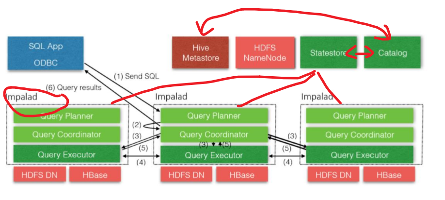

```
1，架构 ； 无主模型   
（C 连接哪个d，d就是去帮C,然后d规划计算）
（d (计算)个数=DN（存） ）

1）角色介绍
statestore  （ss不是主，，但是作用相当于一个传达者，挂了也没有影响，，等会再重启就行）
	
#d 与之建立连接：
	ss广播到所有d，d之间互相知道了（像DN告诉NN，但DN不知道其他DN的存在），

#catalog：
	一启动把Hive ms  的（全量元数据）所有信息都拷了
	然后连接ss，ss广播给d，，   d又知道所有的表信息了

-------------

所以至此，哪个d，都可以当家做主了
（因为哪个机子都可以自己找表，，然后自己推算缺啥，，然后找NN，看看数据在哪，又知道d的存在，去让他计算）

```


```
2）建表流程：

（一致性 ，持久化 都是靠ss广播的）
#d建表，然后告诉ss，
	一致性： 然后再广播给d元数据
	持久化：然后还要广播给cl，，cl弄给HM  （HM持久化作用）


#HM建表，集群不知道，cl不会实时监控，除非给d下命令，然后cl才会去全量扫表，然后再告诉ss，然后再广播  （一般HMS，不变更，变更也是在生产变更日 过程，所以不能反推不是问题）


3）SQL计算特征：
大--->小：聚合操作
小—->大：笛卡尔积

#之前说impala 的内存要很大：（但可以不用全都很大）
你可以要是大的任务，c连接大的d，小的就连小的d


```


```
#2，安装：用CM安装  （要先有Hive）
cl  和 ss ： node1
d ： 2,3  因为杀死DN
```


### 3）操作

#### --基本测试

```
node3：启动hive,,2启动impala-shell ：

1）一启动的时候，能看到hive的表
2）演示速度：统计计数  ： （很快）
	​如果你没有在Hue中创建root，用户，会报错，，它不具有访问hdfs的权限，
3）
	d，，建表，，hm 看元数据
	hm  建表，，d 看不到


```


#### --启动参数 和 shell内

```
#1，启动参数
#常用参数解析：

-q 在外面执行一句的，

（脚本）
-f 执行文件的所有命令，报错就停了
	-c  继续执行了，跳过错误

（两种输出）结果是一个标准输出  1>  和  一堆提示 
-B  （关掉美化） 配合输出到文件， 能把干净的结果弄到文件。
	1> 重定向  把结果输出
    -o ：一个效果    
```


```
#2，在 shell内，操作

增量： 同步一下有的表  全量：到HMS刷新    
#在hive中建表，要想d看到，全量刷新

显示详细级别

profile:  对那种每段时间每次只执行一次的，，就来查看消息。
```


### 4）SQL操作

#### -- 与HSQL  对比

但具有特别的好处  快


#### --基本操作

```
#1，DDL：
1），库
• 创建数据库 
– create database db1; 
– use db1;

• 删除数据库 
– use default； 
– drop database db1

2）建表
• 创建表(内部表) 

– 默认方式创建表： 
 create table t_person1 (id int, name string )
 
– 指定存储方式：
create table t_person2(  id int,  name string )  row format delimited  fields terminated by ‘\0’   stored as textfile;
#impala1.3.1版本以上支持‘\0’ 

– 其他方式创建内部表 
#使用现有表结构：
create table tab_3 like tab_1; 
#指定文本表字段分隔符： 
alter table tab_3 set serdeproperties (‘serialization.format’=‘,’,’field.delim’=‘,’);

---------------

• 创建表(外部表) 
– 默认方式创建表： 
create external table tab_p1(  id int,  name string  ) location ‘/user/xxx.txt’

– 指定存储方式： 
 create external table tab_p2 like parquet_tab  ‘/user/xxx/xxx/1.dat’
 partition (year int , month tinyint, day tinyint)  location ‘/user/xxx/xxx’  stored as parquet;
 
```

```
#2，DML
1）增
 – 直接插入值方式： 
 insert into t_person values (1,hex(‘hello world’));
– 从其他表插入数据：
insert (overwrite) into tab_3 select * form tab_2 ; 
– 批量导入文件方式方式： 
load data local inpath ‘/xxx/xxx’ into table tab_1;


#imp就是个进程，，用imp 去弥补下hive慢。（拿来插值啥的）
当你一直单个insert的时候， imp就产生小文件
	当你一行，就一个文件，就一片了，hive做离线的时候，map就很不好

改进：把表小文件，插到一个临时表中，，，（就用整一次的时间，）

```

#### -- 视图 和 文件处理

```
#1，视图
– 创建视图： create view v1 as select count(id) as total from tab_3 ;
– 查询视图：  select * from v1;
– 查看视图定义：  describe formatted v1
	
#注意；
– 不能向impala的视图进行插入操作 
– insert 表可以来自视图
```

```
#2，数据文件处理 
– 加载数据： 
• insert语句：插入数据时每条数据产生一个数据文件，不建议用此方式 加载批量数据 
• load data方式：在进行批量插入时使用这种方式比较合适 
• 来自中间表：此种方式使用于从一个小文件较多的大表中读取文件并写 入新的表生产少量的数据文件。也可以通过此种方式进行格式转换。 

– 空值处理： 
• impala将“\n”表示为NULL，在结合sqoop使用是注意做相应的空字段 过滤， 
• 也可以使用以下方式进行处理： 
	 alter table name set tblproperties (“serialization.null.format”=“null”)
```


#### --分区

```
• 添加分区方式 
– partitioned by 创建表时，添加该字段指定分区列表
–alter table 进行分区的添加和删除操作 

create table t_person(id int, name string, age int) partitioned by (type string);  alter table t_person add partition (sex=‘man'); 
alter table t_person drop partition (sex=‘man'); 
alter table t_person drop partition (sex=‘man‘,type=‘boss’);

• 分区内添加数据 
– insert into t_person partition (type='boss') values (1,’zhangsan’,18),(2,’lisi’,23) 

• 查询指定分区数据 
– select id,name from t_person where type=‘coder
```


#### --存储 和 压缩


```
#在计算的时候，启用压缩的目标： 减少空间，同时提速
#parquet 格式就好了
```


### 5）整合

#### -- 与hbase

```
#让hive 去和hbase 映射，这样impala自然就可以整合了
#hbase 已经存在，所以 hive 映射用外部表

Impala可以通过Hive外部表方式和HBase进行整合，步骤如下：

• 步骤1：创建hbase 表，向表中添加数据 
– create 'test_info', 'info' 
– put 'test_info','1','info:name','zhangsan' 
– put 'test_info','2','info:name','lisi' 

• 步骤2：创建hive表 
 CREATE EXTERNAL TABLE test_info(key string,name string ) 
ROW FORMAT SERDE 'org.apache.hadoop.hive.hbase.HBaseSerDe' 
STORED by 'org.apache.hadoop.hive.hbase.HBaseStorageHandler' 
WITH SERDEPROPERTIES ("hbase.columns.mapping"=":key,info:name") 
TBLPROPERTIES  ("hbase.table.name" = "test_info");

• 步骤3：刷新Impala表 
– invalidate metadate
```

#### --JDBC

```
• 配置： 
impala.driver=org.apache.hive.jdbc.HiveDriver 
 impala.url=jdbc:hive2://node2:21050/;auth=noSasl
 impala.username= 
 impala.password=

• 尽量使用PreparedStatement执行SQL语句： 
–性能上PreparedStatement要好于Statement 
– Statement存在查询不出数据的情况
```

#### --性能优化


------

------

## 3.3 ooize

### 1）介绍

[]: https://oozie.apache.org/

```
#1，介绍
Oozie是用于 Hadoop 平台的开源的工作流调度引擎。
	用来管理Hadoop作业。

属于web应用程序，由Oozie client和Oozie Server两个组件构成。
	s运行于Java  Servlet容器（Tomcat）中的web程序。（不用单独搭建tomcat，oozie自己弄了）
	s实际是集群主机上的一个进程，

--------------------

#2，作用
```


### 2）架构 与 安装

```
#1，架构
#架构很简单，，就一个在集群中的s
核心角色s:
内部有多个级别，一个一个套一大个
一个中  又可以多个平级，然后多顺序级别的 工作流
	Workflow： 顺序执行流程节点，支持fork（分支多个节点），join（合并多个节点为一个）
	Coordinator，定时触发workflow
	Bundle Job，绑定多个coordinator


流程：
C: 
提交flow 到hdfs，，同时给s提交关于flow的一些信息。
然后c不管了。
S:
s根据信息 ，调度MR，用M task 向XML文件移动，，然后解析执行。

#即一个大的MR，用M 当做流程，然后依次执行服务
#oozie中有一些列的lib包，，也说明具体的内容也要ooize去调度运行 
```


```
#2，安装
```


```
#3，ooize的web管理
http://XX:11000/oozie/ （或者从CM点）

上面的Document 是 Guide
右边的配置信息 以及 一些设置（比如设置时区）

正文都是看workflow就行，能看到Job，操作状态，
#如果失败：
	Ooize 做流程，靠MR 的M  ，，所以日志在M看

```


### 3）操作

#### --CLI

```
#用来操作工作流的 （操作 path的，，操作本主机文件的配置的）

启动任务  （返回job id，直接就运行了，状态running）
oozie job -oozie http://node1:11000/oozie/ -config job.properties –run

停止任务   (状态 ：killed)
oozie job -oozie http://ip:11000/oozie/ -kill 0000002-150713234209387-oozie-oozi-W

提交任务：（也有ID，状态是准备）
oozie job -oozie http://ip:11000/oozie/ -config job.properties –submit

开始任务 ：（把提交的任务启动了，不能开始被停止的任务，因为被kill了）
oozie job -oozie http://ip:11000/oozie/ -config job.properties –start 0000003-150713234209387-oozie-oozi-W

查看任务执行情况：
oozie job -oozie http://ip:11000/oozie/ -config job.properties –info 0000003-150713234209387-oozie-oozi-W
```


#### --手写调度

#hue能够实现拖拽

```
#1，步骤
要写两个文件：
	workflow.xml   ： 提交到hdfs，定义流程的
	job.properties ： 提交给s的，告诉xml的位置等信息


1）job.properties
NN ,job(2.X写RS)，path 一定要写
#libpath 是当oozie，没有那个命令的时候，你要导入jar包  （只自带了这么多）
```


```
2）workflow.xml

2.1）版本信息
<workflow-app xmlns="uri:oozie:workflow:0.4" name=“workflow name"> （0.3/0.4 低版本）

2.2）EL函数  (${XX} 取出值)
```


```
2.3）节点（标签）
```

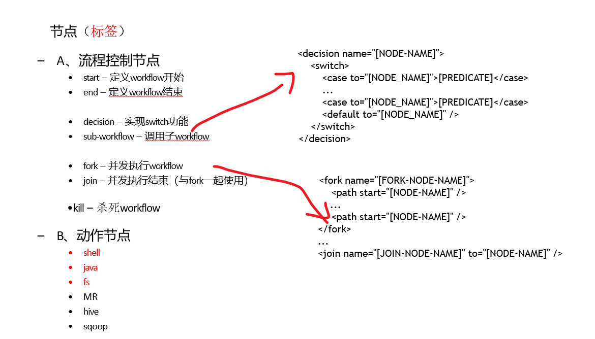


```
#2，例子
1）测试shell


--job.properties  (本机文件在node1中vi ）
nameNode=hdfs://node1:8020
jobTracker=node1:8032
queueName=default
examplesRoot=examples
oozie.wf.application.path=${nameNode}/user/workflow/shell

--workflow.xml (Hdfs 中  hue中写)
<workflow-app xmlns="uri:oozie:workflow:0.3" name="shell-wf">
	<start to="shell-node"/>
	<action name="shell-node">
		<shell xmlns="uri:oozie:shell-action:0.1">
			<job-tracker>${jobTracker}</job-tracker>
			<name-node>${nameNode}</name-node>
			<configuration>
				<property>
					<name>mapred.job.queue.name</name>
					<value>${queueName}</value>
				</property>
			</configuration>
			<exec>echo</exec>
				<argument>hi shell in oozie</argument>
		</shell>
		<ok to="end"/>
		<error to="fail"/>
	</action>
	<kill name="fail">
		<message>Map/Reduce failed, error message[${wf:errorMessage(wf:lastErrorNode())}]
		</message>
	</kill>
	<end name="end"/>
</workflow-app>


----------------
解析：
前面是配置准备啥的，，后面是实际action。
最后有个成功失败的选择，

测试：
因为有了root用户，现在没有报权限错误。
直接启动：
	然后看web,点最后如果没有刷出地址，
	自己手动去找RS：8088，点那个Job 的tracking
	然后点map，再操作，就可以看到想要的日志了

结果不打印在机器上，把标准和 错误 输出重定向到了log


```


```
2）fs节点
workflow.xml

<workflow-app name="[WF-DEF-NAME]" xmlns="uri:oozie:workflow:0.5">
...
<action name="[NODE-NAME]">
<fs>
<delete path='[PATH]'/>
<mkdir path='[PATH]'/>
<move source='[SOURCE-PATH]' target='[TARGET-PATH]'/>
<chmod path='[PATH]' permissions='[PERMISSIONS]' dir-files='false' />
<touchz path='[PATH]' />
<chgrp path='[PATH]' group='[GROUP]' dir-files='false' />
</fs>
<ok to="[NODE-NAME]"/>
<error to="[NODE-NAME]"/>
</action>
</workflow-app>

-------------------------

3）impala
---job.properties
nameNode=hdfs://node1:8020  jobTracker=node1:8032  queueName=default  examplesRoot=examples  oozie.usr.system.libpath=true
oozie.libpath=${namenode}/user/${user.name}/workflow/impala/lib
oozie.wf.application.path=${nameNode}/user/${user.name}/workflow/impala

--workflow.xml
<workflow-app xmlns="uri:oozie:workflow:0.4" name="impala-wf">
<start to="shell-node"/>
<action name="shell-node">
<shell xmlns="uri:oozie:shell-action:0.1">
<job-tracker>${jobTracker}</job-tracker>
<name-node>${nameNode}</name-node>
<configuration>
<property>
<name>mapred.job.queue.name</name>
<value>${queueName}</value>
</property>
</configuration>
<exec>impala-shell</exec>
<argument>-i</argument>
<argument>node2</argument>
<argument>-q</argument>
<argument>invalidate metadata</argument>
<capture-output/>
</shell>
......
</action>
.......
</workflow-app>

-------------------------

4）java
oozie.libpath=${nameNode}/user/workflow/lib/lib4java
oozie.wf.application.path=${nameNode}/user/workflow/oozie/java
```


#### –操作总结

```
#格式：
job: 
命令主要有shell,fs,java
如果涉及直接调度其他jar，则需要导入lib

xml:
上面是模板，准备啥的
下面是具体的

--------------------

#细节：
后面XML，可以通过${} 引用前面的参数。
参数不能再一行写，，不然就变成了一个了。 （当是java的时候，可以传入main的参数）

#问题：
 web 的点最后的不显示MR地址啥的，，虽然能够自己去MR找
```


## impala 和 ooize 

