# hive
# 1 介绍

## 1.1 简介

```
#1，产生：
非java编程者对hdfs的数据做mapreduce操作
#等于封了一层，在hive用SQL语句对hdfs数据做 mapreduce操作

#2，特点：
Hive : 数据仓库。（数据库是交互（快），整合数据库）
Hive：解释器，编译器，优化器等。
Hive 运行时，元数据存储在关系型数据库里面

#大数据，离线
#时间拉链，，，hive不能改变，，会建新的
#元数据存在关系型数据库（不能存在hdfs: 因为hdfs纯数据，丧失了标识）
```


## 1.2 架构

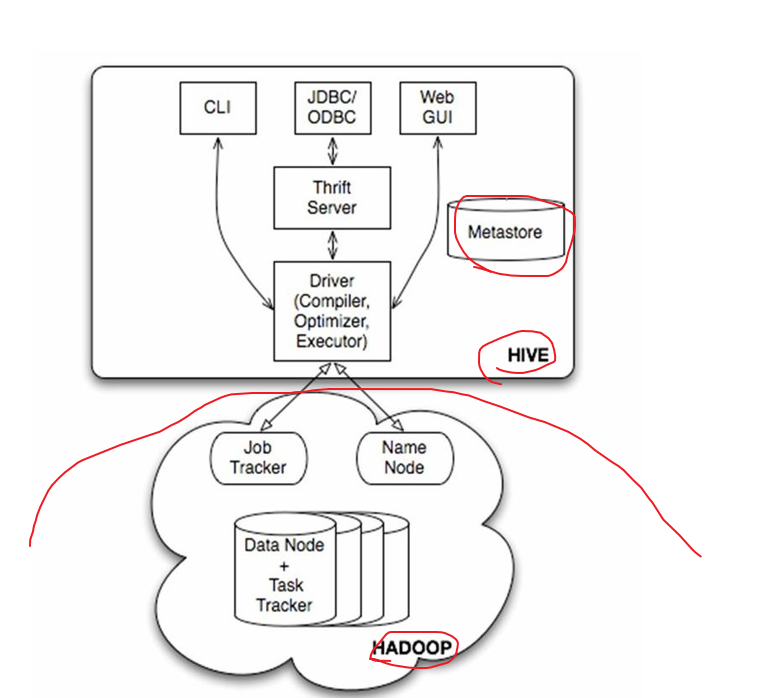

```
#1，
1）driver：
jvm进程, 保证运行的服务。
接受请求，，SQL  编译解释执行mapre
解释器、编译器、优化器完成HQL查询语句从词法分析、语法分析、编译、优化以及查询计划的生成。


2) 用户接口主要有三个：CLI，Client 和 WUI。
其中最常用的是CLI，Cli启动的时候，会同时启动一个Hive副本。

Client是Hive的客户端，用户连接至Hive Server。在启动 Client模式的时候，需要指出Hive Server所在节点，并且在该节点启动Hive Server。(hive  进入。)

WUI是通过浏览器访问Hive。

3）Metastore:
Hive将元数据存储在数据库中，如mysql、derby(自带的)。
元数据包括表的名字，表的列和分区及其属性，表的属性（是否为外部表等），表的数据所在目录等。

4）Hive的数据存储在HDFS中，大部分的查询、计算由MapReduce完成
（包含*的查询，比如select * from tbl不会生成MapRedcue任务）。
```


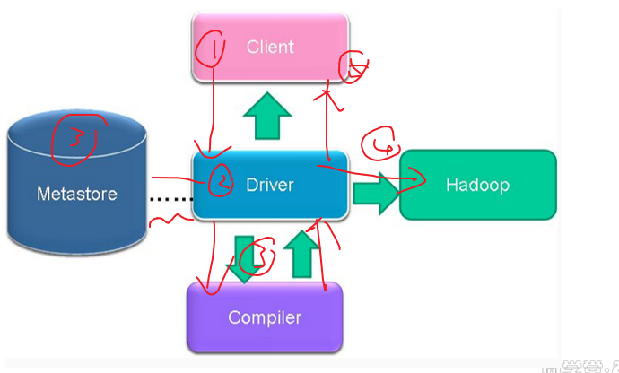

```
#2,
C---请求---D---查看---M----编译解释--Com----布置---H---返回--C

1)补充
编译器将一个Hive SQL转换操作符
操作符是Hive的最小的处理单元
每个操作符代表HDFS的一个操作或者一道MapReduce作业

2）Operator （操作符一般不用自定义）
Operator都是hive定义的一个处理过程
Operator都定义有:
protected List <Operator<?  extends Serializable >> childOperators; 
protected List <Operator<?  extends Serializable >> parentOperators; 
protected boolean done; // 初始化值为false

```


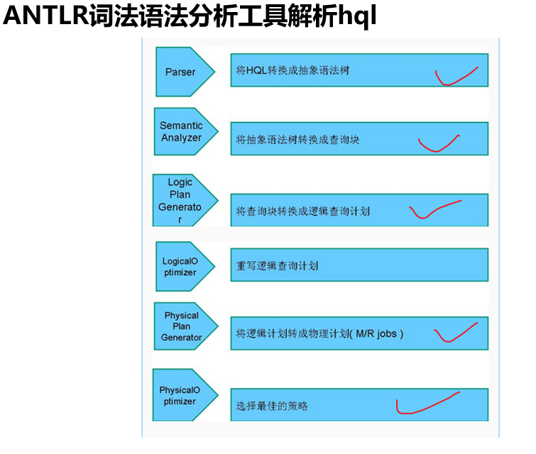

## 1.3 模式

### 1）Local 

就是三个东西都在一起，一般不用 （内置的Derby数据库）

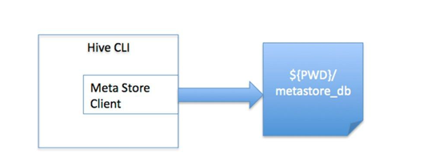

### 2）Remote Metastore Database

一个：Mysql 数据库，，两个在一起：CLI客户端和元数据客户端（driver的一部分任务）

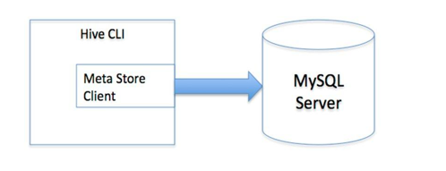

### 3）Remote Metastore Server

一个：Mysql 数据库，，一个：元数据客户端（开启），，，一个客户端（hive进入）


# 2 搭建1.X

[官网]: https://cwiki.apache.org/confluence/display/Hive/AdminManual+Metastore+Administration


## 2.1 Remote Database

第二种，，单体

一个hive的C 和 元数据C(driver)， node:2

  一个sql  ：node1

```
#1，node1：安装mysql（存元数据库）
yum install mysql-server
开启mysql:mysql

1) 错误：Can't connect to local MySQL server through socket '/var/lib/mysql/mysql.sock' (2)
socket说明网络：service  mysqld start (先启动服务)

mysql—show databases—-use mysql—show tabeles—desc user;

2）改密码，通过改登录权限。
grant all privileges on *.* to 'root'@'%' identified by '123456' with grant option;
	#*.*所有库和信息，，%所有地址
	#不能update(因为后面加密了,直接改不知道改成啥):要通过命令授权

然后删除其他：delete from user where host!='%';（因为%包含了）
接下来要重启服务。（重启服务或者flush privileges）,

```

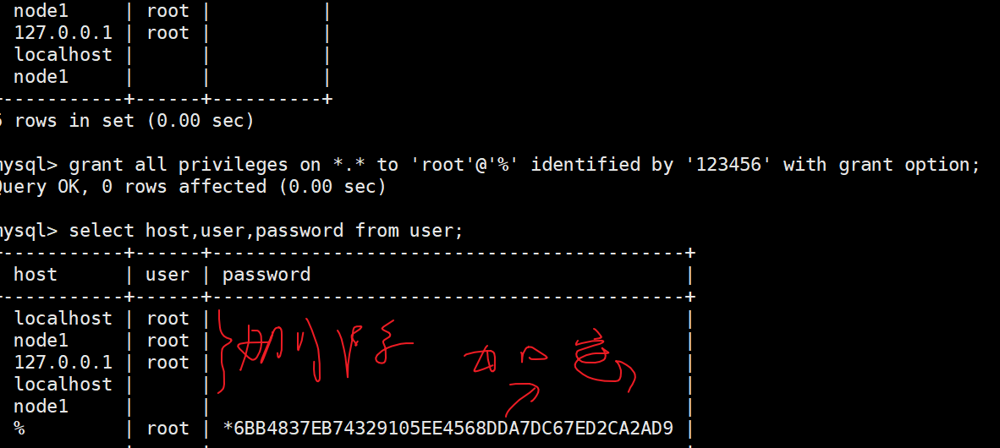


```
#2，node2: hive安装，
1)准备工作：
启动集群：zk,  在n3或4（如果是免秘钥了）启动all，就可以少一个 rm
	补充：哪个没起来就单独去
	hadoop-daemon.sh start nn dn jn dm
	yarn-daemon.sh start  rm 

传进两个文件（hive 和 jdbc）
tar -zxvf hive.tar.gz -C /opt/sxt/
	#mv 改名(没有doc文件，所以只能官网)
	#四种安装模式  ：解压
2)环境
/etc/profile
修改配置: hive/conf/default  改名  hive-site.xml
	#5个： 4，mysql  1，hsdfs
	#末行模式.,$-1d
<property>  
  <name>hive.metastore.warehouse.dir</name>  
  <value>/user/hive_remote/warehouse</value>  
</property>  

<property>  
  <name>javax.jdo.option.ConnectionURL</name>  
  <value>jdbc:mysql://node1/hive_remote?createDatabaseIfNotExist=true</value>  
</property>  

<property>  
  <name>javax.jdo.option.ConnectionDriverName</name>  
  <value>com.mysql.jdbc.Driver</value>  
</property>  

<property>  
  <name>javax.jdo.option.ConnectionUserName</name>  
  <value>root</value>  
</property>  

<property>  
  <name>javax.jdo.option.ConnectionPassword</name>  
  <value>123456</value>  
</property>  

启动hive:hive
#报两个错：
1)没有jdbc驱动，，cp  hive/lib下

2）jline :  hadoop /share/hadoop/yarn/lib 和hive/lib 不一样，，删掉低版本的，然后hive拷贝到hadoop
```


```
#3，操作
1）node1 存元数据
在mysql看到能看表信息的。
#能改属性但是不要再这里改。。会乱
2）操作hive
都是一些SQL语句。（不创建datebase： 默认在default数据库）
#在node1 50070 那个路径。可以看到数据hdfs存的地址：/user/hive_remote/warehouse
```


问题：怎么连接上的hadoop,,之前都没有设置。

Condiguration:  hive会自己去环境变量（/ect/profile的 hadoop）


## 2.2 Remote Server

第三种，，多体

  一个sql  ：node1

一个元数据C(driver，hive元数据的S)， node:3 (和node2一样)

一个hive的C    node:4


```
#0，准备
2分3,4
scp -r /opt/sxt/hive-1.2.1/ node3:/opt/sxt/hive-1.2.1/

3,4 配置
export HIVE_HOME=/opt/sxt/hive-1.2.1
:$HIVE_HOME/bin

修改3,4jline

#1，node1：不变
#2，node3：S（大体和node2类似）

 site:
 只改
 <property>  
  <name>hive.metastore.warehouse.dir</name>  
  <value>/user/hive/warehouse</value>  
</property>  
<property>  
  <name>javax.jdo.option.ConnectionURL</name>  
  <value>jdbc:mysql://192.168.57.6:3306/hive?createDatabaseIfNotExist=true</value>  
</property>  

#3，node4:C
site:
只要
<property>  
 <name>hive.metastore.warehouse.dir</name>  
  <value>/user/hive/warehouse</value>  
</property>  
   
 
<property>  
  <name>hive.metastore.uris</name>  
  <value>thrift://node3:9083</value>  
</property>  


#4:启动
1）启动元服务。 S n3
hive --service metastore
	#阻塞窗口
	#一开始没有9083,启动了才有。ss -nal
2）启动hive   C n4


如果出现4 hive一直卡住，去看3有没有启动，3没有启动看看1mysql有没有启动

#node2，区别node4
	hive启动，，读取配置site文件，，
		2：管两个：元数据服务，hive客户端
		3：已经启动了服务，，，4：hive客户端
#查看hdfs的sqlw文件 n2
hdfs dfs -cat /user/live_remove/wXXX/lbl/*
	#显示的是11  （它用的默认分隔符。。实际是1  1）
	#hdfs纯文本文件 ：自己下来看  XX -get XX rhou 然后 cat -A file
		#显示 1^A1$  : 想要自己定义，要在建表语句
	
```


## 2.3  运行方式

#有3 操作 的知识，把笔记提前了 （设计beeline  和 运行方式 ）

Beeline   是 hiveserver2的客户端


```
#1，启动
#HIVEServer2：为多个远程客户端以及外部连接提供服务。
H2 启动 直接hivesever2

#beeline有两种连接H2的方式：
1）

beeline
!connect jdbc:hive2://node3:10000/default root 123

#用户名密码随便写，但要写。（类似于jdbc连接方式，默认情况不做用户认证）
! close  关闭连接
! quit  退出 b

2）
beeline  -u   jdbc:hive2//node3:10000/default  
#不用写用户密码。

```


```
#2，架构
0) 
hive cli   和   meta 交流。

-------------------------------------

1）
node3：停止 meta  直接hivesever2 （自动启动meta，开启10000端口）

node4:beeline   （一般不这样:因为，这样只能beeline连接h2，关闭了外界对元数据库的访问：即不能hive cli了）

------------------------------------

2） cli  和 h2 互不影响，共有同一个元数据
node3：meta  ;  node4:hs2   

2.1）beeline 在 哪个节点都可以（要beeline程序，即有hive）

node2 bealine 连node4  HS2 ：只是SQL语句简单提交给（把SQL给HS2 服务器运行。）
你在2写的，全部都给了4，（服务器运行，找元数据库服务器3查看元数据）
所以4 ：load文件  。（因此不关2 的文件）：所以一般用于查

#但是权限不让你只load，，（是root的权限）
beeline  -u   jdbc:hive2//node3:10000/default  -n root

#其他问题：
权限：比如像只能特定用户查看表，或者创建等等


2.2)  到网页去（jdbc封一层）
2.3)   jdbc 连接：
private static String driverName = "org.apache.hive.jdbc.HiveDriver";

	public static void main(String[] args) throws SQLException {
		try {
			Class.forName(driverName);
		} catch (ClassNotFoundException e) {
			e.printStackTrace();
		}
		Connection conn = DriverManager.getConnection("jdbc:hive2://node4:10000/default", "root", "");
		Statement stmt = conn.createStatement();
		String sql = "select * from psn0 ";
		ResultSet res = stmt.executeQuery(sql);
		while (res.next()) {
			System.out.println(res.getString(1) + "-" + res.getString("name"));
要有hive中的部分12包。

```

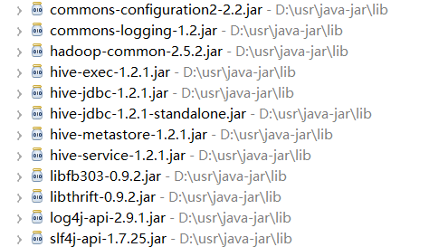


```
#3，运行方式
命令行方式cli：控制台模式
脚本运行方式（实际生产环境中用最多）
JDBC方式：hiveserver2  
web GUI接口 （hwi、hue等：hue好）
```


```
#1，Hive在CLI模式中
#与hdfs交互  （ 快于linux： hdfs dfs ）
	执行执行dfs命令
	例：dfs –ls /
#与Linux交互
	！开头
	例!pwd
```

```
#2，Hive脚本运行方式（hive  --service cli  --help ）

1）hive -e ""：可以写多个语句；
	在hive cli写完退出 
	comm 也可以直接运行
	
2）写脚本 
	vi hive.sh  ：  hive -e “ XXX“
	Chmod +x   ,然后可执行了。

3）hive -S -e " ">aaa  
	（把set  那个全部导出来：more 分页查看)
	直接只显示结果
	参数不能改顺序 –e要跟参数）

4）hive -f file  
	（hdfs:file写SQL语句）

5）hive> source file
	(在hive cli中运行linux 文件)

6) hive -i /home/my/hive-init.sql  
	（初始化：可以写参数或者命令，，不会退出hive cli）
```


```
#3, WEBGUI
Hive Web GUI接口  （HUE好，，这个算了，2.X都没了）
web界面安装：  弄到3下
	下载源码包apache-hive-*-src.tar.gz
	将hwi war包放在$HIVE_HOME/lib/  
		制作方法：将hwi/web/*里面所有的文件打成war包
		#cd apache-hive-1.2.1-src/hwi/web
		#jar -cvf hive-hwi.war *

	复制tools.jar(在jdk的lib目录下)到$HIVE_HOME/lib下
	修改hive-site.xml
site:
<property>
    <name>hive.hwi.listen.host</name>
    <value>0.0.0.0</value>
  </property>
  <property>
    <name>hive.hwi.listen.port</name>
    <value>9999</value>
  </property>
  <property>
    <name>hive.hwi.war.file</name>
    <value>lib/hive-hwi.war</value>
 </property>


启动hwi服务(端口号9999)
hive --service hwi （先停止元数据服务）
浏览器通过以下链接来访问
http://node3:9999/hwi/

```


## 2.4 权限

```
#1，概念
hive 的 权限控制是你登录时候，你输入是啥用户，就认为你是啥。

通过用户，角色，权限三位来控制。
	#同一个元数据，所有的表，用户，角色都是统一共享的

授权模型
1）Storage Based Authorization in the Metastore Server
基于存储的授权 - 可以对Metastore中的元数据进行保护，但是没有提供更加细粒度的访问控制（例如：列级别、行级别）。
2）SQL Standards Based Authorization in HiveServer2
基于SQL标准的Hive授权 - 完全兼容SQL的授权模型，推荐使用该模式。
3）Default Hive Authorization (Legacy Mode)
hive默认授权 - 设计目的仅仅只是为了防止用户产生误操作，而不是防止恶意用户访问未经授权的数据。
4）第三方插件apache

```

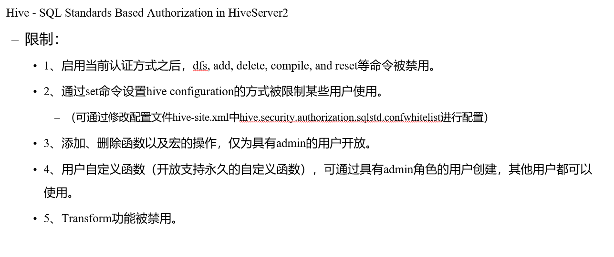

#将采用hs2 模式： 三启动hs2，其他启动beeline

```
#2, 搭建Hive - SQL Standards Based Authorization in HiveServer2
在hive服务端修改配置文件hive-site.xml添加以下配置内容（元数据服务器那里）
<property>
  <name>hive.security.authorization.enabled</name>
  <value>true</value>
</property>
<property>
  <name>hive.server2.enable.doAs</name>
  <value>false</value>
</property>
<property>
  <name>hive.users.in.admin.role</name>
  <value>root</value>
</property>
<property>
  <name>hive.security.authorization.manager</name>
  <value>org.apache.hadoop.hive.ql.security.authorization.plugin.sqlstd.SQLStdHiveAuthorizerFactory</value>
</property>
<property>
  <name>hive.security.authenticator.manager</name>
  <value>org.apache.hadoop.hive.ql.security.SessionStateUserAuthenticator</value>
</property>

3启动hiveserver2；2，4客户端通过beeline进行连接。

```

beeline  -u   jdbc:hive2//node3:10000/default   XX XX 登录用户


```
#2，角色
#role可理解为是一组权限的集合

1）角色的添加、删除、查看、设置
CREATE ROLE role_name;  -- 创建角色（admin）
DROP ROLE role_name;  -- 删除角色(admin)
SET ROLE (role_name|ALL|NONE);  -- 设置角色(有才能切换成功)
SHOW CURRENT ROLES;  -- 查看当前具有的角色
SHOW ROLES;  -- 查看所有存在的角色（admin）

2）授予、移除、查看
授予
GRANT role_name [, role_name] ...
TO principal_specification [, principal_specification] ...
[ WITH ADMIN OPTION ];

移除
REVOKE [ADMIN OPTION FOR] role_name [, role_name] ...
FROM principal_specification [, principal_specification] ... ;

principal_specification
  : USER user
  | ROLE role

查看
#查看授予某个用户、角色的角色列表  （看用户XX，有啥授予的角色）
SHOW ROLE GRANT (USER|ROLE) principal_name;

#查看属于某种角色的用户、角色列表  （查看谁拥有被授予的角色XX）
SHOW PRINCIPALS role_name; （admin）


```

```
3) 实战
以两个用户登录进去：
A：!connect jdbc:hive2://node3:10000/default root 123
B：!connect jdbc:hive2://node3:10000/default user1 123

A：
show  roles;  			#admin 和 public
create role tets;
show roles:				#admin 和 public 和tets
GRANT tets TO USER user1; 
SHOW ROLE GRANT USER user1; （在root和 user1 运行结果一致。）
SHOW PRINCIPALS tets;（只能root 用户运行）
```


```
B：
后面有tets 角色；
不能 select 等对表的操作
```


```
#3，权限
#给角色等，加入权限，就可以操作表了。
1）类型
SELECT privilege – gives read access to an object.
INSERT privilege – gives ability to add data to an object (table).
UPDATE privilege – gives ability to run update queries on an object (table).
DELETE privilege – gives ability to delete data in an object (table).
ALL PRIVILEGES – gives all privileges (gets translated into all the above privileges).


2）权限的授予、移除、查看
#授予
GRANT
    priv_type [, priv_type ] ...
    ON table_or_view_name
    TO principal_specification [, principal_specification] ...
    [WITH GRANT OPTION];

移除
REVOKE [GRANT OPTION FOR]
    priv_type [, priv_type ] ...
    ON table_or_view_name
    FROM principal_specification [, principal_specification] ... ;

查看
SHOW GRANT [principal_name] ON (ALL| ([TABLE] table_or_view_name)

3）权限的授予、移除、查看
A:
grant select on table psn0 to role tets;

B：可以直接 select * from psn0;
show grant role tets on table psn0;
```


关于你如何设置权限的：

[Privileges Required for Hive Operations]: \2hadoop\source\option


# 3 操作

[language Manual]: https://cwiki.apache.org/confluence/display/Hive/LanguageManual

DDL（定义：创建），DML（操作：增删改查），DCL（控制：授权，回退，提交）

```
SELECT [ALL | DISTINCT] select_expr, select_expr, ... 
FROM table_reference 

[WHERE where_condition] 
[GROUP BY col_list] 
[ORDER BY col_list] 
[CLUSTER BY col_list | [DISTRIBUTE BY col_list] 
[SORT BY col_list] ] 
[LIMIT [offset,] rows]

```

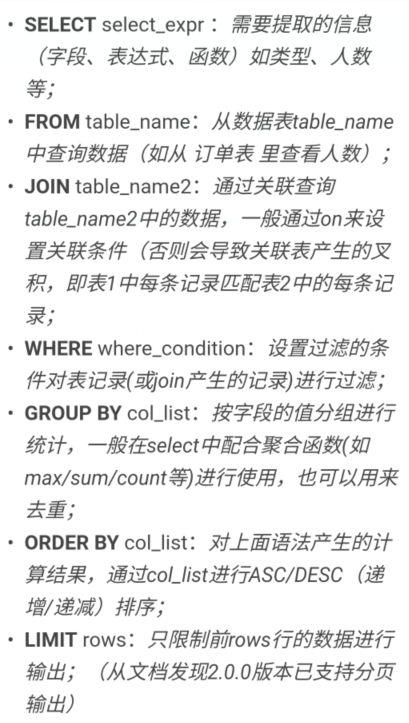


## 3.1 DDL

#创建table，会生成value_tmp_tabl_1，删了这个表没影响

[createtable]: file:\2hadoop\source	"一定要按照顺序写"

```
#1,建表语法：
1）数据类型
data_type   （所有的）
  : primitive_type
  | array_type
  | map_type 
  | struct_type    (数据类型可以不一致，类似于C的，但只考虑属性)
  | union_type  -- (Note: Available in Hive 0.7.0 and later)

primitive_type   （基本的）
  : TINYINT
  | SMALLINT
  | INT
  | BIGINT
  | BOOLEAN
  | FLOAT
  | DOUBLE
  | DOUBLE PRECISION -- (Note: Available in Hive 2.2.0 and later)
  | STRING
  | BINARY      -- (Note: Available in Hive 0.8.0 and later)
  | TIMESTAMP   -- (Note: Available in Hive 0.8.0 and later)
  | DECIMAL     -- (Note: Available in Hive 0.11.0 and later)
  | DECIMAL(precision, scale)  -- (Note: Available in Hive 0.13.0 and later)
  | DATE        -- (Note: Available in Hive 0.12.0 and later)
  | VARCHAR     -- (Note: Available in Hive 0.12.0 and later)
  | CHAR        -- (Note: Available in Hive 0.13.0 and later)

array_type
  : ARRAY < data_type >

map_type
  : MAP < primitive_type, data_type >

struct_type
  : STRUCT < col_name : data_type [COMMENT col_comment], ...>

union_type
   : UNIONTYPE < data_type, data_type, ... >  -- (Note: Available in Hive 0.7.0 and later)

2）开始 :   其他的看文件链接里的
建表 ctrea tabele
定义分隔符：
	#默认的行格式：^A
文件格式：默认TextFile
	行存（格式不变，），列存（人看不懂）

```

```
3）操作
数据：


create table psn
(
id int,
name string,
likes array<string>,
address map<string,string>
)
row format delimited
fields terminated by ','
collection items terminated by '-'
map keys terminated by ':';

4) 查看
decs table;  看表列简单。。
decs formatted table；
	Location:// 集群id /地址
	Storage  Desc Params    ！！！可以看到多了格式format
	InputFormat  Output:  从任意地方格式读取，源无所谓

```

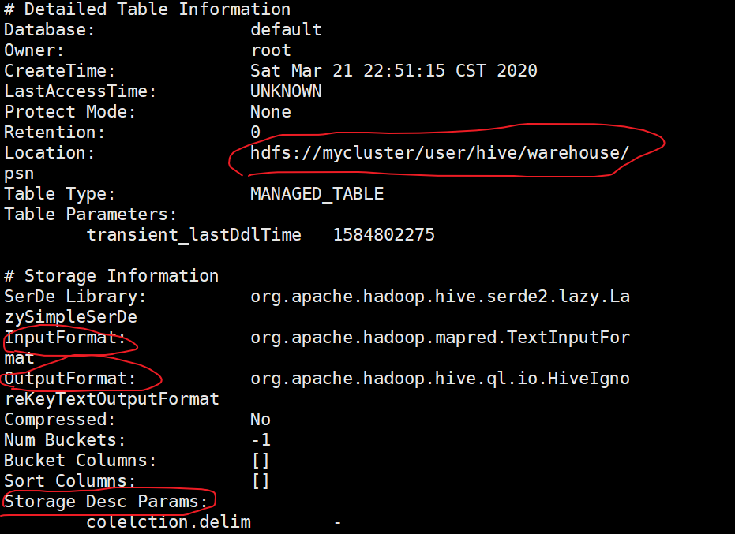


```
#2，其他建表方式
1） 跑mr(全复制)
create table psn8 as select * from psn3;

2) 不跑mr(只复制结构)
create table psn9 as like psn3;


#需要数据处理跑mr，不需要不跑
```


------

删表table

```
#删表：
drop table ; 

只是删数据而已：表还在
truncate table psn;  清空数据
delete还不能用：DML需要事务

```


## 3.2 DML


### 1）读取格式

```
#DDL里的：

Hive通过ROW FORMAT DELIMITED以及SERDE进行内容的读写。

row_format

: DELIMITED 
     [FIELDS TERMINATED BY char [ESCAPED BY char]] 
     [COLLECTION ITEMS TERMINATED BY char]
     [MAP KEYS TERMINATED BY char] 
     [LINES TERMINATED BY char] 

: SERDE serde_name [WITH SERDEPROPERTIES (property_name=property_value, property_name=property_value, ...)]

#正因为只规定了读的格式：构建在数据存储和执行引擎之间，对两者实现解耦。

#分割只是做简单的操作，SerDe 可以用正则，更加复杂（例如后者可以把数据里的无关东西符号等去掉）
```


#### ——分隔符

hive select  显示 都是一个样子，

靠你写的特定DDL语句，从有特定格式的hdfs读取，变成同样hive展示

```
#1， 采用自己的 上面定义的分隔符
#数据：1,小米1,lol-book-movie,beijing:sxt-shanghai:sxt

建表时，以及产生了/psn目录，只是内容为空。

直接文件：就是简单copy/move文件，不用mr。 （内）
load data local inpath '/root/data/data' into table psn;   (local linux 本地，比价hdfs)

#load data  inpath '/usr/data' into table psn;
	#是从hdfs 本地读取，然后会把这个移走到 hive目录下。
#如果一个个自己来，慢是MR中的洗牌慢，
select * from psn;
	#这个查询也不用MR

```


#limit 限制输出，（SQL语句）

#desc  table

desc +表名用来显示表的状态，包括列名（column name），各个列的类型（Type），各个列的值类型，主外键（Key），默认值，其他；


```
#2，默认分隔符
	自定义分隔符，在互相嵌套的情况下，分不开，所以用默认的
#数据：文件用^A  ^B(ctrl + A )分割:

1） #建表语句不用任何操作，自己默认分割
create table psn2
(
id int,
name string,
likes array<string>,
address map<string,string>
)
```


```
2）用\001
create table psn3
(
id int,
name string,
likes array<string>,
address map<string,string>
)
row format delimited
fields terminated by '\001'
collection items terminated by '\002'
map keys terminated by '\003';

#Storage Desc Params: 显示\u00
#Hive 结果还是显示一样的。
```


------

#### ——SerDe

```
SerDe 用于做序列化和反序列化。
#Hive正则匹配
 CREATE TABLE logtbl (
    host STRING,
    identity STRING,
    t_user STRING,
    time STRING,
    request STRING,
    referer STRING,
    agent STRING)
  ROW FORMAT SERDE 'org.apache.hadoop.hive.serde2.RegexSerDe'
  WITH SERDEPROPERTIES (
    "input.regex" = "([^ ]*) ([^ ]*) ([^ ]*) \\[(.*)\\] \"(.*)\" (-|[0-9]*) (-|[0-9]*)" 
  )
  STORED AS TEXTFILE;

#一个\“ 是简单转义，匹配"字符。。\\[  是re，让他变成字符 
数据：192.168.57.4 - - [29/Feb/2016:18:14:35 +0800] "GET /bg-upper.png HTTP/1.1" 304 -

显示：(类似这样的table):  而分隔符不能做到把[] ""去掉
```


### 2）操作

```
#1，插入
有四种:前两种常用
```


```
#分区，在1,2 要表明分区
1) loading : copy/move file into table
LOAD DATA [LOCAL] INPATH 'filepath' [OVERWRITE] INTO TABLE tablename [PARTITION (partcol1=val1, partcol2=val2 ...)]

2) 操作查询结果
#2.1  Standard syntax:  一句
#覆盖
INSERT OVERWRITE TABLE tablename1 [PARTITION (partcol1=val1, partcol2=val2 ...) [IF NOT EXISTS]] select_statement1 FROM from_statement;

#追加
INSERT INTO TABLE tablename1 [PARTITION (partcol1=val1, partcol2=val2 ...)] select_statement1 FROM from_statement;
 
#2.2   Hive extension (multiple inserts):
FROM from_statement
INSERT OVERWRITE TABLE tablename1 [PARTITION (partcol1=val1, partcol2=val2 ...) [IF NOT EXISTS]] select_statement1
[INSERT OVERWRITE TABLE tablename2 [PARTITION ... [IF NOT EXISTS]] select_statement2]
[INSERT INTO TABLE tablename2 [PARTITION ...] select_statement2] ...;


FROM from_statement
INSERT INTO TABLE tablename1 [PARTITION (partcol1=val1, partcol2=val2 ...)] select_statement1
[INSERT INTO TABLE tablename2 [PARTITION ...] select_statement2]
[INSERT OVERWRITE TABLE tablename2 [PARTITION ... [IF NOT EXISTS]] select_statement2] ...;
 
#2,3 Hive extension (dynamic partition inserts):
INSERT OVERWRITE TABLE tablename PARTITION (partcol1[=val1], partcol2[=val2] ...) select_statement FROM from_statement;
INSERT INTO TABLE tablename PARTITION (partcol1[=val1], partcol2[=val2] ...) select_statement FROM from_statement;


#主要就是： 把多句，写在了一句里面
FROM psn
INSERT OVERWRITE TABLE psn10
SELECT id,name
insert into psn11
select id,likes ;

#表要提前存在
#目的：
	1，保存查询结果
	2，分割只遍历一次（且只跑一次MR），减IO
	3，中间结果
```


```
3）普通insert
INSERT INTO TABLE tablename [PARTITION (partcol1[=val1], partcol2[=val2] ...)] VALUES values_row [, values_row ...]

4） write 进去
insert overwrite local directory '/root/result' 
select * from psn;

#小心别覆盖全部了。但root目录直接全覆盖了
```


```
#2，update，delete
#ACID(原子性，一致性，隔离性，持久性)
#三范式：  
	(确保每列保持原子性：如果你需要拆，当时设计的时候就要设计出多列)
	(确保表中的每列都和主键相关：把多余的联合主键要拆，确保每个表的主键与列确相关)
	(确保每列都和主键列直接相关,而不是间接相关：更进一步保证)
	
要用事务管理器（hive支持事务，但是要求太多了）

```


### 3）内外部表


```
#1，内部表：
最终数据都，存在table_name 的目录下。 例XX/psn1/data
先有表，然后load数据
	#两种都是要将数据移动到指定目录下

#2，外部表： 
（把指定文件的 里面的文件和目录都读了，如果目录的，如果create没有写分区报错，就算写了，如果没有修复，也显示不出来）：所以一个下的文件，就专门的一个表。
最终数据，还是在自己的hdfs目录下  。例/path/ + 直接data（没有表名）
先有数据（上传到指定）：
	hdfs dfs -mkdir   
	hdfs dfs -put
然后创表：
create external table psn4
(
id int,
name string,
likes array<string>,
address map<string,string>
)
row format delimited
fields terminated by ','
collection items terminated by '-'
map keys terminated by ':'
location '/usr/';
#自动了，然后不用手动插值

两种在hive显示中是没有区别的，（除了desc那个会显示）
在mysql中，也没有的
```


```
#3，区别
1）创建表的时候，
内部表直接存储在默认的hdfs路径，
	先有的表，，然后放进数据
外部表需要自己指定路径:
	先有数据，然后想分析，建表指定路径就行 
	（如果想用内，建表，然后还要再迁移路径（load））

2）删除表的时候， drop table XX
内部表会将数据和元数据全部删除，外部表只删除元数据，数据不删除

3)注意：
hive：读时检查（数据存储hdfs 和 分析hive 实现解耦，提高数据记载的效率）
关系型数据库：写时检查


	读时检查 ：可以随便写，，读的时候才匹配
	写时检查 ： 关系型数据库
#因此，把任何文件弄进psn hive地址里,就是不能正确显示

```


## 3.3 分区

mr:为数据不倾斜,随机分布（p数量看 数据量，数据key种类 业务决定）

hive: 数据分区。省得全盘扫描找数据 ( 看业务颗粒度)    ，离线数据

​	#在table  和  data 前 加个目录的 （你需要啥就去指定的找就行了）

### 1）静态分区

#自己指定的值，做分区。

```
#1，单分区：
create table psn5
(
id int,
name string,
likes array<string>,
address map<string,string>
)
partitioned by(age int)
row format delimited 
fields terminated by ','
collection items terminated by '-'
map keys terminated by ':';
#分区列也是列，不用写

//建了一层新目录，select显示数据也多一列（关于分区的）
load data local inpath '/root/data/data' into table psn5 partition(age=10)  ;
load data local inpath '/root/data/data' into table psn5 partition(age=20)  ;
select * from psn5;//就显示了全的 data

/psn5/age=10/data
/psn5/age=20/data
```

#分区有限制，不能太多

```
#2, 双分区：
create table psn6
(
id int,
name string,
likes array<string>,
address map<string,string>
)
partitioned by(age int,sex string)
row format delimited 
fields terminated by ','
collection items terminated by '-'#
map keys terminated by ':';


#load按字段名匹配（先找名，再找值，因此赋值随便顺序），
#create最开始定义的先得，目录层级为父
	多层目录了，先建age,然后sex

#创表后，就创建好了目录，然后copy,data
#表定义了分区K，是几个就是几个，不能改的 （层数确定了）
	alter  table XX add partition 
	加值V ：用来建目录，不倒数据（刚刚是load，自动了）。。分区的V要写够（和load匹配一个道理）
	
	XX   dropXX 
    删的K，V不用写够也行 ：
    	指定了父:删父删子
    	指定了子：跨删子（所有是V的子都删了）

#只有静态分区有
```


```
#3, 查询
Hive查询执行分区语法
SELECT * FROM table WHERE table.dt>= '2008-08-08'; 
（dt是一个分区）
```


### 2）静态外表分区问题

```
先在/usr/创建  /age=10  和 /age=20 的目录，然后分别传入data
再建表：
create external table psn7
(
id int,
name string,
likes array<string>,
address map<string,string>
)
partitioned by(age int)
row format delimited
fields terminated by ','
collection items terminated by '-'
map keys terminated by ':'
location '/usr/';


元数据信息有内表的分区信息，这时候，但是没有外表的。
#C通过，提交到 S，然后查元数据，，发现没有外表的分区信息。所以读不到。


#就算你标明了partitioned,不像内表，有load,或者 add，赋值那个。
所以要修复：
msck repair table psn7

```


#动态分区 和 分桶 步骤 类似 （现有原始表，然后结果表，然后插入数据,  查询（分桶的是抽样查询））

### 3）动态分区

#现有的列，当做分区：走MR

```
#1，准备：开启支持动态分区 （3.5参数的知识）
set hive.exec.dynamic.partition=true;
默认：true
set hive.exec.dynamic.partition.mode=nostrict;
默认：strict（至少有一个分区列是静态分区）

#相关参数（补充）
	set hive.exec.max.dynamic.partitions.pernode;
	每一个执行mr节点上，允许创建的动态分区的最大数量(100)
	set hive.exec.max.dynamic.partitions;
	所有执行mr节点上，允许创建的所有动态分区的最大数量(1000)
	#一种目录是一个分区 （2父*2子=4个）
	
	set hive.exec.max.created.files;
	所有的mr job允许创建的文件的最大数量(100000)
		#1G内存（整个机器，10W个文件描述符）
		#ulitima  -a  (一个进程可以打开的描述符个数)
```

```
数据：就是多了两行。
2）原始表：
create external table psn7_1
(
id int,
name string,
age int,
gender string, 
likes array<string>,
address map<string,string>
)
row format delimited 
fields terminated by ','
collection items terminated by '-'
map keys terminated by ':';

#导数据

3）结果表

create external table psn7_1
(
id int,
name string,
likes array<string>,
address map<string,string>
)

partitioned by(age int,gender string)
row format delimited 
fields terminated by ','
collection items terminated by '-'
map keys terminated by ':';

分区有，所以列不用写

4）原始插入结果
	#指定分区，select要写全,

insert into psn7_2  partition(age,gender)
select id ,name,likes,address,age,gender  from 7_1;


```


## 3.4 分桶

走mr

```
#1，介绍
#原本数据不管几B，，在HDFS系统中，都是显示一个文件（细节显示B 和 副）。
#分桶就会一个目录有多个文件，分区是多个目录，分别一个文件

-桶表是对列值取哈希值的方式，将不同数据放到不同文件中存储。（列 % bucket  哈希）
-分桶是把原来的数据（表和分区的），弄出来进一步。（存在新的表目录下）
（弄新的出来，要啥，你的原始表就该select啥，然后插新表上）

适用场景：  ！！！！！
	数据抽样（ sampling ） 和 事务支持前提

```

数据： 

1,tom,11

2,cat,22   ……………………..

```
#2，操作
1）准备：开启支持分桶
set hive.enforce.bucketing=true;

默认：false；
设置为true之后，mr运行时会根据bucket的个数自动分配reduce task个数。（用户也可以通过mapred.reduce.tasks自己设置reduce任务个数，但分桶时不推荐使用）
#之前是一般0,1， 设置后re=bucket
注意：一次作业产生的桶（文件数量）和reduce task个数一致。

2）原表
CREATE TABLE psn8( id INT, name STRING, age INT)
ROW FORMAT DELIMITED FIELDS TERMINATED BY ',';

3）结果表
CREATE TABLE psn8_1 ( id INT, name STRING, age INT)
CLUSTERED BY (age) INTO 4 BUCKETS 
ROW FORMAT DELIMITED FIELDS TERMINATED BY ',';

4）插入
insert into table psn8_1 select id, name, age from psn8;

```

```
5）抽样查询
select id, name, age from psn8_1 tablesample(bucket 2 out of 4 on age);
#抽桶为2，的一个。

TABLESAMPLE(BUCKET x OUT OF y  on XXX )
	x：表示从哪个bucket开始抽取数据
	y：必须为该表总bucket数的倍数或因子

例：总Bucket 为 32，，3 of 8：
	先32/8: 选四个，间距为8，起点为第3文件（余数是2）。
	3,11,19,27

#最后的大了报错。
```

1,tom,11,a
2,cat,22,b
3,dog,33,a
4,hive,44,b
5,hbase,55,a
6,mr,66,b
7,alice,77,a
8,scala,88,b


```
#动态分区和分桶实例
1）动态
create table t1
(
id int,
name string,
age int,
flag string
)
row format delimited 
fields terminated by ',';
-----------
load
------------
create  table t1_1
(
id int,
name string,
age int
)
partitioned by(flag string)
row format delimited 
fields terminated by ',';
#t1_1目录下是空的

---------
insert into t1_1 partition(flag)
select id ,name,age,flag from t1  limit 8;
```


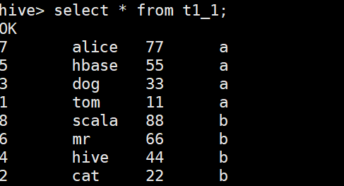

```
#2）
CREATE TABLE t2 ( id INT, name STRING, age INT,flag string )
CLUSTERED BY (age) INTO 4 BUCKETS 
ROW FORMAT DELIMITED FIELDS TERMINATED BY ',';

----
insert into table t2 select id, name, age ,flag from t1_1;

----
select id, name, age from t2 tablesample(bucket 2 out of 4 on age);
select id, name, age from t2 tablesample(bucket 4 out of 2 on age);
```

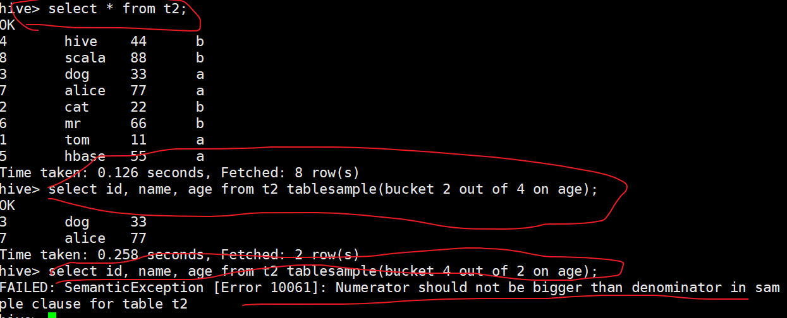


```
# 外部操作分区表的时候，表是一整块的。
```


## 3.5 函数

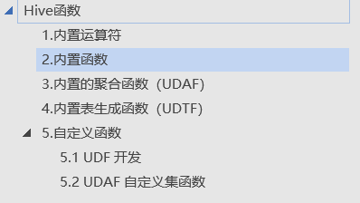

[函数文档]: \2hadoop\source\hive_func.docx

```
#1，自定义函数：
自定义函数包括三种UDF、UDAF、UDTF
UDF(User-Defined-Function) 一进一出
UDAF(User- Defined Aggregation Funcation) 聚集函数，多进一出。Count/max/min
UDTF(User-Defined Table-Generating Functions); 一进多出，如lateral view explore()

使用方式 ：在HIVE会话中add 自定义函数的jar文件，然后创建function继而使用函数

```


```
#0) 自定义函数格式：
	a）自定义UDF需要继承org.apache.hadoop.hive.ql.UDF。
	b）需要实现evaluate函数，evaluate函数支持重载。


public class TuoMin extends UDF {

	public Text evaluate(final Text s) {
		if (s == null) {
			return null;
		}
		String str = s.toString().substring(0, 3) + "***";
		return new Text(str);
	}

}
```


```
1）jar 到linux
#hive：
add jar  path;
create temporary function func as ‘ 包.类名 ’
#临时函数

select  func()

2）hdfs
hdfs dfs -put path;
#hive:
create temporary function func as ‘ 包.类名 ’ using jar ‘hdfs:///path/’
```


## 3.6 参数

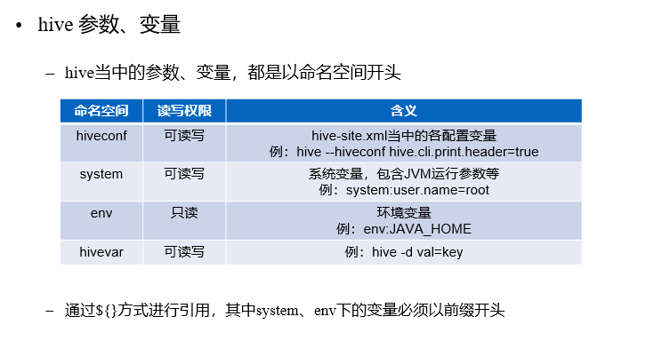

```
#1，操作参数 （当前hive 有效）

	1）hive cli时，通过--hiveconf key=value的方式进行设置
	#hive --hiveconf hive.cli.print.header=true
	
	2）在cli时，通过使用set
	#set hive.cli.print.header=true;

#或者永久：修改配置文件 ${HIVE_HOME}/conf/hive-site.xml

#在hive CLI控制台可以通过set对hive中的参数进行查询、设置
set（打印参数变量）
set hive.cli.print.header（查看默认值）

#2，变量：（当前hive 有效）
	hive -d abc=1
	hive –hivevar abc=1
		#var=${abc}（引用）

#hive --service cli  –help  (不写默认 cli，查看帮助：-service X)

#3, 其他：
1）当前节点用户家目录下的.hiverc文件（~/.hiverc）
如果没有，可直接创建该文件，将需要设置的参数写到该文件中，hive启动运行时，会加载改文件中的配置。

2）hive历史操作命令集
~/.hivehistory

```


## 3.7 例子

#1， struct 属性展示

```
创建数据表
CREATE TABLE test(id int,course struct<course:string,score:int>)
ROW FORMAT DELIMITED
FIELDS TERMINATED BY '\t'
COLLECTION ITEMS TERMINATED BY ',';

数据:
1 english,80
2 math,89
3 chinese,95
入库
LOAD DATA LOCAL INPATH '/home/hadoop/test.txt' INTO TABLE test;
查询
hive> select * from test;
OK
1       {"course":"english","score":80}
2       {"course":"math","score":89}
3       {"course":"chinese","score":95}

hive> select course from test;
{"course":"english","score":80}
{"course":"math","score":89}
{"course":"chinese","score":95}

select course.course from test t; 
english
math
chinese

```


#2，WC

```
from (  select explode( split(sentence,',')) word from hive_wc  ) t
insert into result
select word,count(1) group by word;

#统计单词出现次数PS:使用虚拟表必须用别名

```

count(1)  count(列)  标识作用。。。


#3,每个基站的断线时长占总时长的rate 的前十

```
1）读取的表
create table test2
( time string,
  i string,
  cell string,
  ph string,
  call string,
  d int,
  a int,
  o1 string,
  o2 string,
  o3 string
)
ROW FORMAT DELIMITED
FIELDS TERMINATED BY ','
tblproperties ("skip.header.line.count"="1");


#跳过前后的几个
tblproperties ("skip.header.line.count"="1", "skip.footer.line.count"="1");


2) 结果表
CREATE TABLE test2_1
(i string,
 new double)
ROW FORMAT DELIMITED
FIELDS TERMINATED BY ',';


insert into table test2_1
select i , sum(d)/sum(a) new 
from ( select i, d ,a  from test2 ) t1  group by i  order by new  desc limit 10  ;


#后面进一步数据可以用别名，select中计算的时候不能。（因为本次还没结束）
#from 最好里面不能多次复杂计算，，丢外面的select
```

node3:8088 mapreduce

​	#applictiaon 里的 log 

​		：或者当你配置好，本身会有个job_history进程，（把log，写进hdfs）

​	#tools 的 configuration  里面有所有配置


## 3.8 Lateral视图索引

### 1）Lateral View 

```
#1，概念
hive Lateral View
	Lateral View用于和UDTF函数（explode、split）结合来使用。
	
	首先通过UDTF函数拆分成多行，再将多行结果组合成一个支持别名的虚拟表。
	
	主要解决在select使用UDTF做查询过程中，查询只能包含单个UDTF，不能包含其他字段、以及多个UDTF的问题
#两个UDTF不能一起  或 列和它都不行
#解决后：多个UDTF可以一起 或 group再加count和字段 或 不count加字段
```

```
#2，操作
LATERAL VIEW udtf(expression) tableAlias AS columnAlias (',' columnAlias)

例子： （统计 likes  , address 分别有多少种。）
select count(distinct(myCol1)), count(distinct(myCol2)) from psn2 
LATERAL VIEW explode(likes) myTable1 AS myCol1 
LATERAL VIEW explode(address) myTable2 AS myCol2, myCol3;

#表名别名随便起，重复都行。列注意（除非你用表.列，可以重复，别闲的没事）。
```


### 2）视图

```
#1，概念
降低查询复杂度：
当查询变得长或复杂的时候，通过使用视图将这个查询语句分割成多个小的、更可控的片段来降低复杂度。使用分层设计的思想是一致的。
```

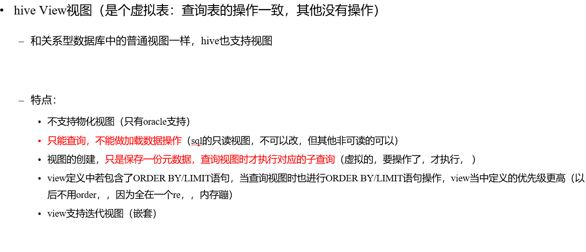

```
#2，操作
View语法

#创建视图：
CREATE VIEW [IF NOT EXISTS] [db_name.]view_name 
  [(column_name [COMMENT column_comment], ...) ]
  [COMMENT view_comment]
  [TBLPROPERTIES (property_name = property_value, ...)]
  AS SELECT ... ;
Create view name  as select XXXX；

#查询视图：
select colums from view;

#删除视图：
DROP VIEW [IF EXISTS] [db_name.]view_name;

```


### 3）索引

```
#1，概念
Hive 索引（SQL，会自动给唯一键，建索引）
	目的：优化查询以及检索性能

```


```
#2，操作

#创建索引：
create index t1_index on table psn2(col_name) 
as 'org.apache.hadoop.hive.ql.index.compact.CompactIndexHandler’ 
with deferred rebuild 
in table t1_index_table; （文件名称，偏移量，接一下那个图）
	#as：指定索引器；
	#in table：指定索引表，若不指定默认生成在default__psn2_t1_index__表中
									(ds-table-index)
create index t1_index on table psn2(name) 
as 'org.apache.hadoop.hive.ql.index.compact.CompactIndexHandler' 
with deferred rebuild
in XXX;

#查询索引：
show index on psn2;
select * from default__psn0_t1_index__;（类似于元信息）


#hive SQL自动使用：
Select  正常用就行。 
（有索引表，先这个，，，如果数据量小，还不如没有索引快）
（hdfs文件，，，hive只是给个元数据信息，给你信息，，然后你操作还是要遍历hdfs文件，原来文件根本上没有变化）

#重建索引：（慢，不是更新了立马就索引，而是等会）
（建立索引之后必须重建索引才能生效，这读数据才开始mr）
ALTER INDEX t1_index ON psn REBUILD;
	#表有新的，不会自动更新
	#二次开发：一般附加，都是全都重新建索引，二次（做到，只是添加），源码可以自己写

#删除索引：
DROP INDEX  t1_index ON psn;
```


### 


# 4 优化

```
#Hive 优化：
核心思想：把Hive SQL 当做Mapreduce程序去优化

Explain 显示执行计划  （ANTLR那个）
	EXPLAIN [EXTENDED] query
#会显示出，你的SQL任务，执行流程
```


## 4.1  抓取策略（不MR）

```
以下SQL不会转为Mapreduce来执行
	select仅查询本表字段
	where仅对本表字段做条件过滤

Hive抓取策略：
	Hive中对某些情况的查询不需要使用MapReduce计算

抓取策略 
	Set hive.fetch.task.conversion=none/more; （不需要就more，默认也是more）
```


## 4.2 运行和并行

```
#1，Hive运行方式：
	本地模式
	集群模式

本地模式：
开启本地模式（当前的hive 端，本地运行，看不到8088执行计划了）
set hive.exec.mode.local.auto=true;

#注意：
hive.exec.mode.local.auto.inputbytes.max默认值为128M
#表示加载文件的最大值，若大于该配置仍会以集群方式来运行！
```

```
#2，并行计算：
通过设置以下参数开启并行模式
	（select  from  select  XX ，select XX)
		---后面两个没有依赖关系，过程： 后面两个同时进行）
set hive.exec.parallel=true;

注意：hive.exec.parallel.thread.number 
（一次SQL计算中允许并行执行的job个数的最大值  ：8）

#要资源申请，可能还不如不并行快呢。
```


## 4.3 查询严格和排序

```
#1，严格模式（不是动态分区：那个严格必须至少一个静态）

通过设置以下参数开启严格模式：
set hive.mapred.mode=strict;
（默认为：nonstrict非严格模式）

查询限制（提高查询效率的，限制你查询的要求）
	1) 对于分区表，必须添加where对于分区字段的条件过滤；
	（不能查整个表了，）
	2) order by语句必须包含limit输出限制；
	3) 限制执行笛卡尔积的查询。(就是组合出来的所有结果)

```

```
#2，Hive排序
Order By - 对于查询结果做全排序，只允许有一个reduce处理
（当数据量较大时，应慎用。严格模式下，必须结合limit来使用）

Sort By - 对于单个reduce的数据进行排序
Distribute By - 分区排序，经常和Sort By结合使用

Cluster By - 相当于 Sort By + Distribute By
（Cluster By不能通过asc、desc的方式指定排序规则；

#可通过 distribute by column sort by column asc|desc 的方式）

```


## 4.4 join

```
#1，小表
Join计算时，将小表（驱动表）放在join的左边（最少可能次数少）
#Map Join：在Map端完成Join
	MR实现join的步骤：  MR写程序是M-  K：V1，V2。（两个表）
	然后R –join，，现在只用map。：就是自动把小表加入内存，大表来依次比较  

两种实现方式：

#尽可能使用相同的连接键（会转化为一个MapReduce作业）

1）SQL方式，在SQL语句中添加MapJoin标记（mapjoin hint：那个标记）
语法：
SELECT  /*+ MAPJOIN(smallTable) */  smallTable.key,  bigTable.value 
FROM  smallTable  JOIN  bigTable  ON  smallTable.key  =  bigTable.key;

2）开启自动的Map Join

通过修改以下配置启用自动的mapjoin：
set hive.auto.convert.join = true;
（该参数为true时，Hive自动对左边的表统计量，如果是小表就加入内存，即对小表使用Map join）

相关配置参数：（注意前两个就行）
	hive.mapjoin.smalltable.filesize;    
	（大表小表判断的阈值，如果表的大小小于该值则会被加载到内存中运行  默认25M作业）
	hive.ignore.mapjoin.hint；
	（默认值：true；是否忽略mapjoin hint 即mapjoin标记）
	-------------
	hive.auto.convert.join.noconditionaltask;
	（默认值：true；将普通的join转化为普通的mapjoin时，是否将多个mapjoin转化为一个		mapjoin）
	hive.auto.convert.join.noconditionaltask.size;
	（将多个mapjoin转化为一个mapjoin时，其表的最大值）

```


```
#2，大表 （可能没有效果，主要是处理空Key）
大表join大表（可能还是得R join。，下面可能作用不明显，因为拿到的数据已经是规则了）

空key过滤：有时join超时是因为某些key对应的数据太多，而相同key对应的数据都会发送到相同的reducer上，从而导致内存不够。此时我们应该仔细分析这些异常的key，很多情况下，这些key对应的数据是异常数据，我们需要在SQL语句中进行过滤。

空key转换：有时虽然某个key为空对应的数据很多，但是相应的数据不是异常数据，必须要包含在join的结果中，此时我们可以表a中key为空的字段赋一个随机的值，使得数据随机均匀地分不到不同的reducer上

大表  * 大表最容易数据倾斜，，
```


## 4.5 map压缩和文件合并

```
#1，Map-Side聚合

#过设置以下参数开启在Map端的聚合 （使用前，你要考虑你是否需要聚合：如果聚合后，根本没压缩多少，还不如压缩了呢）
set hive.map.aggr=true;

相关配置参数：就1,2 5 尤其5
	hive.groupby.mapaggr.checkinterval： 
	#map端group by执行聚合时处理的多少行数据（默认：100000）

	hive.map.aggr.hash.min.reduction： 
	#进行聚合的最小比例（预先对100000条数据做聚合，若聚合之后的数据量/100000的值大于	该配置0.5，则不会聚合）

	hive.map.aggr.hash.percentmemory： 
	#map端聚合使用的内存的最大值

	#ive.map.aggr.hash.force.flush.memory.threshold： 
	#map端做聚合操作是hash表的最大可用内容，大于该值则会触发flush


	hive.groupby.skewindata  
	#是否对GroupBy产生的数据倾斜做优化，默认为false
	（原先是一套MR，group的可能会有一个R过多，根本执行不下去，，这个true，，会有两套，第一个MR是随机压缩下，然后第二个是按照自己，，虽然可能慢了，但是数据小了，能运行下去）

```


```
#2，合并小文件
合并小文件
文件数目小，容易在文件存储端造成压力，给hdfs造成压力，影响效率
#IO多，，根本不够一块128M（快多又不满），M多

设置合并属性
是否合并map输出文件：hive.merge.mapfiles=true
是否合并reduce输出文件：hive.merge.mapredfiles=true;
合并文件的大小：hive.merge.size.per.task=256*1000*1000


#3，去重统计

数据量小的时候无所谓，数据量大的情况下，由于COUNT DISTINCT操作需要用一个Reduce Task来完成，这一个Reduce需要处理的数据量太大，
就会导致整个Job很难完成，一般COUNT DISTINCT使用先GROUP BY再COUNT的方式替换
（和上面5，类似）
```


## 4.6 MR数量  , JVM重用

```
#1,
1)Map数量相关的参数（map=split）
mapred.max.split.size
#一个split的最大值，即每个map处理文件的最大值
mapred.min.split.size.per.node   凑齐文件剩下的  
#一个节点上split的最小值
mapred.min.split.size.per.rack    凑齐节点剩下的
#一个机架上split的最小值

2)Reduce数量相关的参数（除了桶是 和桶一样，其他一般默认0,1，r设置要对文件大小了解）
mapred.reduce.tasks
#强制指定reduce任务的数量
hive.exec.reducers.bytes.per.reducer
#每个reduce任务处理的数据量
hive.exec.reducers.max
#每个任务最大的reduce数
```


```
#2，JVM重用
适用场景：
小文件个数过多
task个数过多

通过 set mapred.job.reuse.jvm.num.tasks=n; 
来设置（n为task插槽个数：一直保持这样，省得来回开关）

缺点：设置开启之后，task插槽会一直占用资源，不论是否有task运行，直到所有的task即整个job全部执行完成时，才会释放所有的task插槽资源！

```


# 5 HA

#高可用：  KEEPALIVE（负载均衡那里的，有一台机子弱），，或者ZK（要有集群，复杂）

zkCli.sh：进入ZK客户端，能查看有啥：Hadoop，，，yarn,,,,,和ZK信息


[搭建]: 2hadoop\source\hive-HA.docx


# 6 压缩和存储

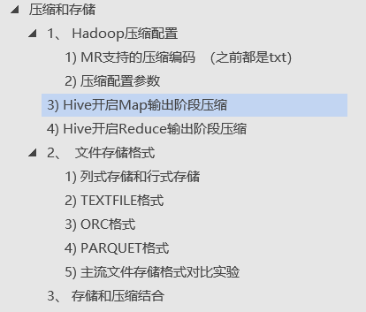

[文档]: 压缩和存储.doc

orc (snappy压缩模式) 查询速度更快

所以在数据仓库的建设过程当中尽量的使用orc的这种模式再加上压缩模式。一方面减少磁盘的使用量，一方面可以实现数据的split（分布式计算），实现查询速度加快。

#可以直接sql。