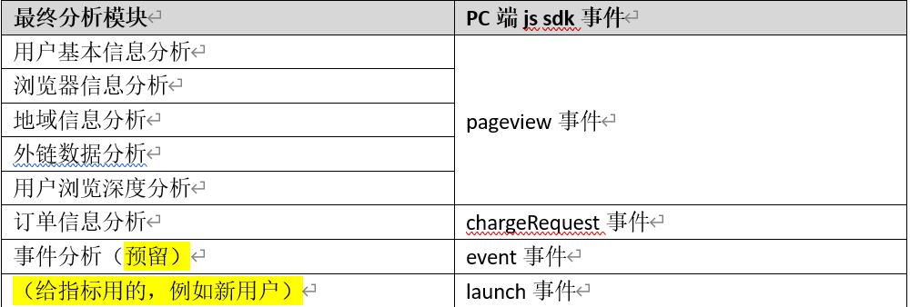
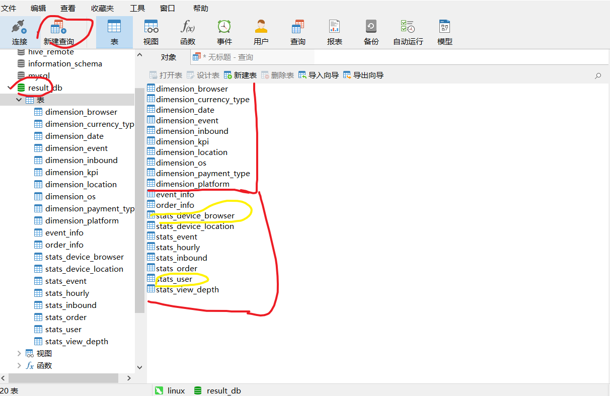
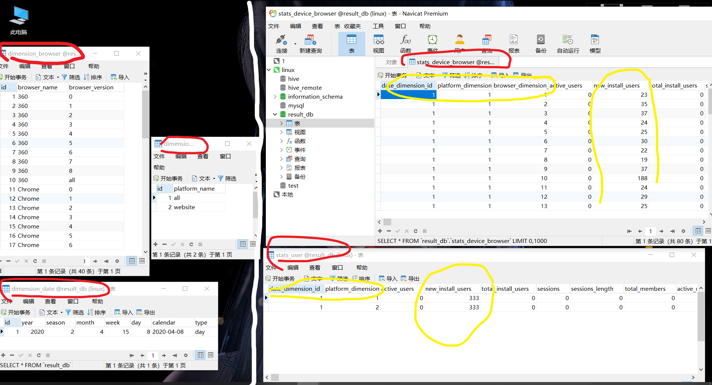
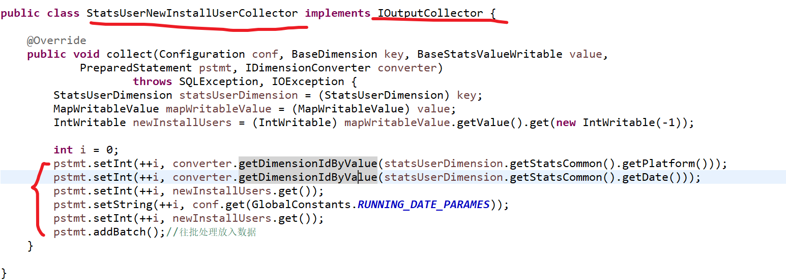
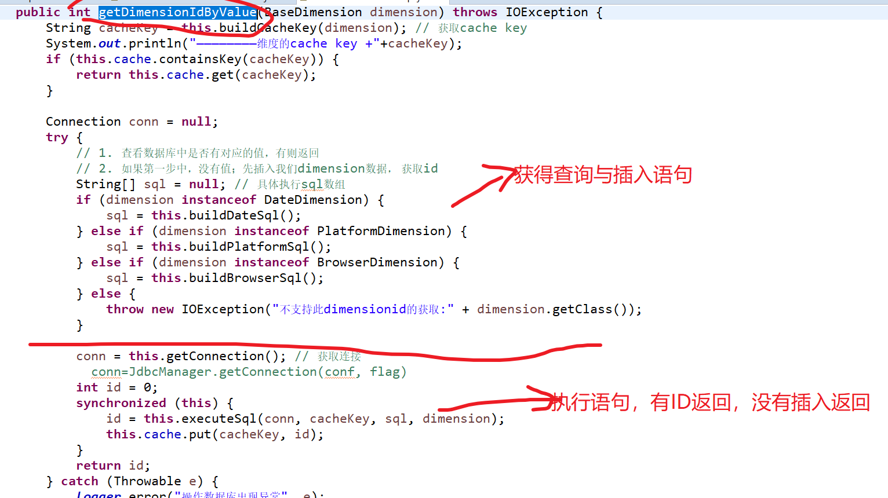
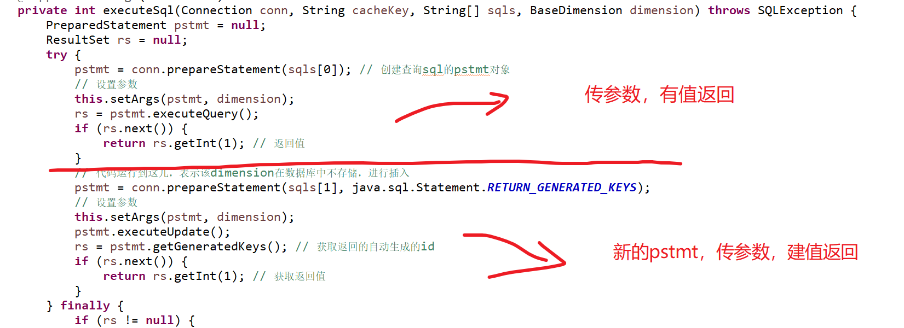
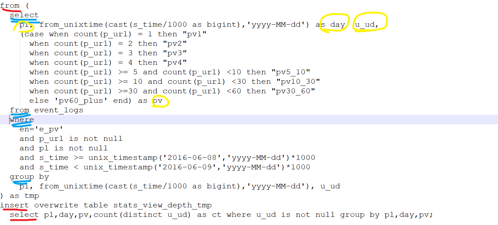
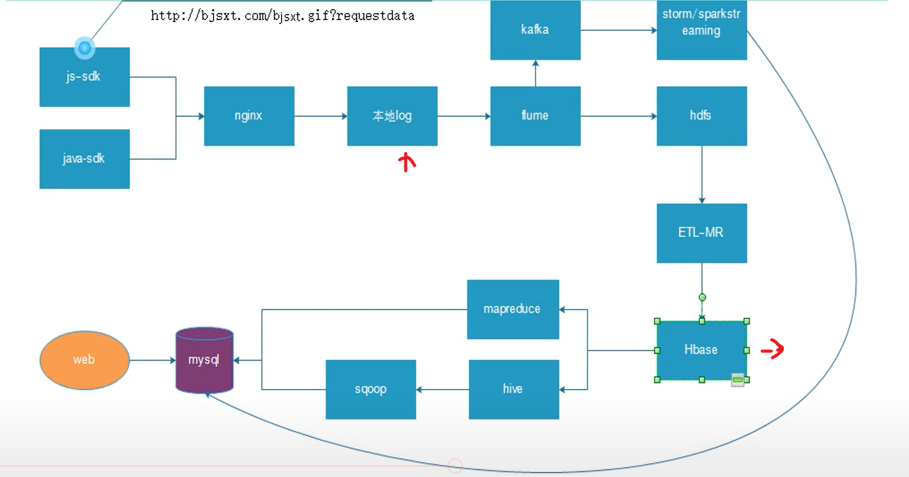

用户行为日志分析

# 0 总起

```
#一些知识准备：
数据量：   一般日GB     淘宝等TB

pv: 多少人看了
uv ： 唯一ip,有多少看了

#访问网站两种方式
一个直接该网页  （内部数据）
一个间接，先通过其他，然后该网页（才能被一般人统计行为日志）
```


[三个]: /source/1

#黄标是自己加的笔记，

#注释是自己的疑问


## 0.1 最终需求展示

#描述本次项目最终七个分析模块的界面展示

```
七个模块
用户基本信息分析模块、 （用用户/会员角度，分析相关信息指标）
浏览器信息分析模块、   （啥浏览器，和 分辨率）
地域信息分析模块、      （通过IP，Nginx拿到地域 。）
用户浏览深度分析模块、    （看几个不同网页）
外链数据分析模块、        （哪个外链引流多）
订单分析模块				（订单的情况）
事件分析模块				 （预留模块）

三个指标  （指标由维度组合限定）
例
新增用户，活跃用户，总用户，新增会员，活跃会员，总会员等信息指标

维度 （指给指标加条件，例如下面的时间，浏览器维度）

```


----


## 0.2 数据来源

```
#不采用ip来标示用户的唯一性，我们通过在cookie中填充一个uuid来标示用户的唯一性。

1）数据：
形如http://bjsxt.com/bjsxt.gif?requestdata 


2）数据源： （描述不同的requestdata ）
	​js  :埋点。
	​java : 有后端业务逻辑，异步线程，消息队列

3）要考虑数据如何向后端发 
这用get：
	post: 不显示，安全，
	get:  会显示，不安全


Nginx：
日志数据，往后台发，往哪里发：Nginx （不是Tomcat，因为有高并发）

当你点开网页，，然后有业务和日志（js 和 java）两套，（js日志直接发送到nginx,java涉及业务代码，但也不影响业务），nginx 通过location匹配出/bjsxt.gif 存到指定位置。


#其他知识：现在网站都是，一个大框架，然后不同服务，实际都是由不同服务器完成的（大框架引用很多src）


事件：（就是发送的requestdata）
java 2 种 ， js 6种   。总共7中模块

#java:   订单模块 （支付与退款）
#js:
	pw:其他
	cs: 订单 （单纯进入订单页面了）
	预留模块
	指标


二者都是 XX=XX&XX=XX  （有个en= e_l/e_pv/e_crt/e_e）
```


### 1）js

1 js的 核心：产生事件流程


2 

```
#2，事件分析
针对我们最终的不同分析模块，我们需要不同的数据
```




```
#3,参数
有共有的还有每个事件自己的
```


### 2）java

```
#1，流程
在业务逻辑代码中，完成

#2，事件
只有订单信息分析：成功与退款
#本项目只考虑成功

#3，参数
有成功与退款的共享  以及 二者特有的
```


## 0.3 项目流程


#本项目分四大步

```
#1，把日志存到本地log,
1）数据来源  （js,,java-sdk）
#这是日志系统，，不能对业务系统产生影响，
	js不对业务有影响，直接发
	java涉及了逻辑代码，有影响，
		（所以加个队列，异步线程去操作，就把消息放到队列，然后业务逻辑就不管了，所以对业务没有影响力。）
		（但有一点问题，当nginx消耗快，就空，线程被关闭，队列慢就阻塞，占资源。。但可以用java那个并发包解决）


2）nginx  到  本地log
#nginx前，还要location匹配url  /bjsxt.gif
#指定目录存。

---------------------

#2，log 存到 hbase
3）flume 将log  发到hdfs
#flume 还能动态生成目录，按照条件维度，把log 存到不同hdfs 目录下

4）ETL：这里仅仅指T。
	#清理无效url
	#将IP变成 地域
	#弄出浏览器名称
	#row-key设计

#公司不用MR清洗，，有专门的工具

------------------------

#3，数据分析  （SQL,MR实现，围绕 指标和维度）
5）MR
#从一个维度一个MR，变成 组合一个MR（省资源，，省IO），，，

MR是自己写输出类对接mysql

6）hive
#hive 整合HBASE，，（指直接用SQL，分析HB，，还有Phoenix也可以），
#HBASE 到 HIVE，，都是在hdfs，所以考虑直接Hive查hbase

sqoop，弄成mysql  （sqoop等于别人帮忙弄好了）

#4，展示
web调用请求，从mysql查数据
#echart图标展示


```


# 1 获取数据

## 1.1 模拟数据来源

### 1）js 设计


#js 产生日志文件的  ，， jsp是网页代码 （通过src埋点，引用js）

```txt
#1，js


1）代码逻辑：（四大部分）

{

​cookie        ：客户端缓存，拿来存一些信息的，基本不用修改
​tracker		：  主体操作

	1）clientConfig  ：一些基本连接设置
	2）columns ： 共有参数    keys  ：特有参数  （那个requestdata的参数的名称）
	3）一些get/set  ：(获取id/保存到cookie)   会话sid,    用户uuid ，商品mid
	4）核心startSession:  (js最终自动触发的)
		（打开网页，，看cookie是否有SID，
			=有:  然后看是否过期，
				==没过期:直接更新下时间，pw事件，
				==过期:   开启会话，然后看看是不是新用户，
					===不是直接就开启新的S，然后接着，
					===是，则开启会话，然后触发L事件。
			=没有SID，创建SID，然后同新用户一样 
		最终一定要有PW事件，，看看有没有其他事件 ）

```


```
	5） 4）的一些准备工作
		A，timeout ，update
		B，createNewSession :   弄个新的Sid，再判断是否新用户
```


​	

```
		C，事件  ：  四个
		都是先preCallApi() ，调用事件前，保证一定是有S的
		然后 {} 包含参数，，先设置特有的，然后set共有的
		然后sendDataToServer （this.parseParam(event)）
#发送给服务端，（this.clientConfig.serverUrl + "?" + data 就是那个核心的）
#那个parse是把kv 变成 XX=XX&
		最后更新下时间
```

```
window 		对外
​autoLoad

调用autoLoad()
}()          ：执行上面整个
```


```
2）理解
#内部大量{}  kv格式
#src 选image: 可以向后发送，而且url不跳转，不要返回值（进一个网站，，自动往后提供服务的发送，且不跳转）


#流程：
网页，加载JS代码，，然后()执行;
然后load方法，然后执行window 的 startSession,,调用tracker主题的startSession（那个核心选择流程）


#事件触发：
最终都要PW 事件  上面两个自动触发
cr ,event 用户点击行为触发
```


```
3）实践

#准备：
Tomcat  ：prefer--->server 那里添加Tomcat7
然后加build path  选 server run 的 lib
然后项目 run on server
（服务器已经启动成功）
```


```
#测试：
用浏览器访问 http://localhost:8080/BIG_DATA_LOG2/

```


```
先第一次，然后会现有L事件，，然后pv，，其次其他每个页面都是先pv 点中别的，生成别的
当你第二词关闭在看，，只有pv
清除cookie后和第一次一样
```


### 2）java设计


#java 发日志 （一个产生，一个发送）    ，，另一包测试用的    

```
#1，代码逻辑

1）SDK 产生
#ctrl 0 查看方法
```


```
三个方法

A 先map 代替{} 存参数
B map不能直接传递，用build函数变成url
C SendDataMonitor.addSendUrl(url)   单例
```


```
2)send 函数
单例对象。
add 调用 get 
add:  getSendDataMonitor().queue.put(url);
get:  先单例判断，里面多线程 异步里面 run : take()取出 然后http 发送这个url

```


```
#2,理解
#你业务put，就行，不用管take。
#并发队列自动解决  放入与  异步线程取出数据 的 阻塞与唤醒（concurrent ）
```


上面都是在模拟，如何产生数据。

现在日志写入到nginx （并发轻松10W）

## 1.2 存到本地log

```
#1，前言
#先安装，同时能够开机启动，那个txt
#监控conf/access.log   ，当你访问网页会增加访问日志 tail -f conf/access.log 监控日志

访问 node1/
#nginx 显示 404  是 nginx/html 下面没有资源  （你可以放个图片上去）
```


```
#2，实践
conf 的 nginx.conf
1）先改日志 格式：
在http加：FORMAT   四个参数
log_format my_format '$remote_addr^A$msec^A$http_host^A$request_uri';
#（ip，服务器时间，host名，请求url ）

官网可以看，两个地方看 http://tengine.taobao.org/nginx_docs/cn/docs/
	#core module  的内嵌变量
	#或者log module  
```

```
2）匹配规则
location   =/log.gif{
 default_type image/gif;
 access_log /opt/data/access.log my_format;
}

#类型，以及log存到本地哪
```


```
3）实践
service nginx start
#这时候就有opt/data目录了

tail -f /opt/data/access.log

刚刚写的两个数据源，，发送给nginx
js  		#alert 是提醒 弹出那个界面
java端
```


#已经完成保存到了本地log

#界面也没有变，，所以发送这个，，对业务没有影响。。


------

------

# 2 存到hbase

## 2.1  log -flume- hdfs 

exec  —->  flume ——>  hdfs

```
#1, conf
1)
# Name the components on this agent
a1.sources = r1
a1.sinks = k1
a1.channels = c1

# Describe/configure the source
a1.sources.r1.type = exec
a1.sources.r1.command = tail -F /opt/data/access.log -n 1

# Describe the sink
a1.sinks.k1.type = hdfs
a1.sinks.k1.hdfs.path = /log/%Y%m%d
a1.sinks.k1.hdfs.filePrefix = events-
a1.sinks.k1.hdfs.rollInterval = 0
a1.sinks.k1.hdfs.rollSize = 10240000
a1.sinks.k1.hdfs.rollCount = 0
a1.sinks.k1.hdfs.useLocalTimeStamp = true
a1.sinks.k1.hdfs.callTimeout = 60000
a1.sinks.k1.hdfs.fileType = DataStream
a1.sinks.k1.hdfs.idleTimeout = 10

# Use a channel which buffers events in memory
a1.channels.c1.type = memory
a1.channels.c1.capacity = 1000
a1.channels.c1.transactionCapacity = 100

# Bind the source and sink to the channel
a1.sources.r1.channels = c1
a1.sinks.k1.channel = c1

2)解释
source:
tail -n  控制你每次连文件时，读入的倒数数据（保证重复的少点）
sink:
path 只写到ymd，就可以控制按天来生成目录。
但是要控制roll。（只大小，新开）
文件不要前缀，和 不压缩
当你不往文件输入时，一定时间后关闭（不然一直占用，也没法写入完成）
	#当你重新在写时，会开启个新文件
```


```
#2，实践
flume-ng agent --conf-file project --name a1 -Dflume.root.logger=INFO,console

#那两个服务器造真实数据，，直接访问node1/log.gif造加数据
结果类型：三个文件
	错误
	正确js
	正确java


#传输完一次后，先.tmp  然后不操作时间到了，才传输成功，变成hdfs  ，
再传输 ,hdfs 开启了新的新的文件写入。
```


数据：（三部分，access.log 原本有数据，，因为tail -n  1 所以只重复了一行）


## 2.2   ETL

### 1）准备

```
#1，介绍一些包

#先测试：用到测试test  以及对应的etl下的工具包
```


```
#2，做什么

1）ip
#在线 ip.taobao.com
#离线测试：
类：
IPSeeker  :一堆用来提取地址的方法 ，用到离线映射库：qqwry.dat
IPSeekerExt ：让提出的地址描述更精确 同时 把信息封装到类里面(调用父类，提取)  
```


```
test:
#
有字符串，广东省广州市
局域网

#
（没过滤局域网，默认上海）
能用类包装：RegionInfo [country=中国, province=内蒙古自治区, city=呼和浩特市]
 * 如果是国外的ip，那么直接设置为unknown unknown unknown<br/>
 * 如果是国内ip，如果没法进行解析，那么就设置为中国 unknown unknown<br/>
```


```
2）浏览器
#解析浏览器的user agent的工具类，内部就是调用这个uasparser jar文件

调用jar的方法，然后把信息封道类里
```


```
test:
UserAgentInfo [browserName=Firefox, browserVersion=45.0, osName=Windows, osVersion=Windows 8.1]
```


```
3)url  	   : 切，去掉不合格的，，然后再切，把k,v弄出来
4)row_key  :  时间一定要有（你用时间去查的），然后配合crc32编码加点东西
```

#存到hbase : 就是row_key，，然后后面一推CF：k = v 0


### 2）MR-ETL -> hbase

```
#1，包介绍
```


```
1）common：
公共的东西  ： 常量，枚举类（可以用来，你的输入和枚举的所有属性 比较名字或者别名。

2）util:
公共的util:  Time  转换时间的
#EJob 提交MR的，jdbc 连接的   （还没用到）

3）核心  : etl
Runner (采用新的写法) 和 Mapper
内部工具类：完成代码逻辑的
```


```
#2，过程
#没有聚合，就是清洗下数据。所以只要runner  和mapper
#一个文件至少一个块，，虽然调三个map，但是都是用统一逻辑map的。
#map 方法一行调用一次。

1）runner 新的方式
#继承Tool, 然后可以传入可变参数，用来控制输入地址。
#往hbase写，必须要那个方法不管有没有re

设置路径
2）mapper （从dfs读，普通继承，输出写到了Put里，方法里帮了setouptformat，这个里面有个方法用来连接表对象）

先得到所有信息的Map （loguitl核心方法：ip,浏览器都打散，以及其他kv）
然后进一步操作：
	先去掉浏览器的那个长信息
	然后生成rowkey: 时间__ (用户，会员ID，事件)crc32编码 取模  只要8位整数                 把所有Map都放进列族

#本地集群运行：
程序参数，，，JVM参数
```


```
#3，结果
#利用cleanup：  当每个map执行完自己的块，执行的。
三个map ：
输入数据:19；输出数据:19；过滤数据:0
输入数据:2；输出数据:2；过滤数据:0
输入数据:3；输出数据:0；过滤数据:3

#总共正确的21条，并且hbase格式如下

```


# 3 数据分析

## 3.0 设计思路

```
#1，思路来源
#指标是我们要求的值，，维度是在给定条件下求指标

1）例：
我们要统计学生人数，这就是指标
但同时有 学生分男女，又分带不带眼镜，，这是给定维度。

而我们的目标试求，给定维度下的指标

共有以下维度组合
（戴眼镜男生
 不戴眼镜男生
 戴眼镜女生
 不戴眼镜女生）

张三 男 戴眼镜
里斯 男 不戴眼镜
```

```
2）思路
#之前思路都是，你给个维度，我去遍历下数据，然后求指标，即每次新的维度组合，就要新的遍历。

现在：
当你遍历数据的时候，就一次把所有的维度组合都弄上

map:
#k: 维度组合，，，v:唯一标识（用来去重） 

#同k一起，，去重累加。。(同个key，就表示一个指标指标，分别求指标)


!!!!!!
map:
男生			张三
戴眼镜男生		张三
戴眼镜			张三
男生			里斯
不戴眼镜男生	里斯
不戴眼镜		里斯

reduce:
男生			张三		1+1=2
男生			里斯

戴眼镜男生		张三		1
不戴眼镜男生	里斯		1

戴眼镜			张三		1
不戴眼镜		里斯		1

#最终可以一次性，得到多个维度组合下的指标值
```


```
#2，实践

#1）拿新增用户来说：
在用户基本信息模块中：(维度： 时间)
在浏览器分析模块中：(维度：   时间，浏览器信息)

map:(k:时间   和   时间+浏览器  V:用户唯一标识)
reduce:(k:时间 v ：个数   k：时间 + 浏览器 ：个数)

#2）改进：
方便结果放入Mysql,给加个模块名称的维度，来表示求得啥

（时间，平台，user）
（时间，浏览器，平台，browser）

#平台由可以统一起来有个 all，，，浏览器同理有个all。
（对于一条数据而言，要不是一个，要不就统计all）
就这样而言：
一条数据，，共有6个维度组合：
1 X 2 X 1 + 1 X 2 X 2 X1 = 6

zhangsan www.bjsxt.com	2018-12-29 firefox-48	website 
lisi	 www.bjsxt.com	2018-12-29 firefox-53	website

2018-12-29,all,user						zhangsan 
2018-12-29,website,user					zhangsan 

2018-12-29,firefox-48,website,browser	zhangsan
2018-12-29,firefox-all,website,browser	zhangsan
2018-12-29,firefox-48,all,browser		zhangsan
2018-12-29,firefox-all,all,browser		zhangsan
```


## 3.1 MR

### —1：初步介绍———

### 0）包介绍


#圈出来的是抽象类 （单维度的实现wc接口，组合的继承单，，值的实现w接口）

```
#model：就像po，，含着类结构
--dim：维度信息，base是单维度
--下面是组合维度。

#value: 里面规定了map，re 的value 是个类封装。。。然后key是上面的维度组合
#mr：就是写指标的地方
```


### 1）三个类书写（新增）

#统计在不同维度下的新增，即只有L事件才触发

#初步先不考虑，怎么存到mysql的，先看统计


```
#1，Runner
写好骨架就行。
1）入口： conf 外置，main函数入口run。
2）实现
getConf：
setConf: 两个连接集群，以及 三个xml 文件
run: job设置
processArgs()
TableMapReduceUtil.initTableMapperJob()

re:
#map re 输出的格式不是自带的一定要指定，
setMapOutputKeyClass/setOutputKeyClass
输出到mysql
setOutputFormatClass(TransformerOutputFormat.class)


#先实现基本的统计功能
```

#接口，和 抽象，，为了多态。（别的方法用到这个类就写一个就行，多态自己找，，没有多态，	有一个类就要重弄方法）


```
#2.mapper  ：输出kv

假设已经拿到scan数据。（runner中传入）（一个row_key，一次map方法）

步骤：

在外面
定义好输出的类对象（省内存），以及列族，和标识 （这两不受row影响，）

map中：
1）单维度 对象封装，注意除了时间，其他是两个list对象
2）唯一标识对象封装 ：uuid 和 time
3）拼接维度组合  ： 两大类：（起始也就是两张表）
例： key:
user ： 时间 + 平台   + kpi标识   
browser： 时间 +平台 + 浏览器+标识 ，  

两重for ：时间两大类一样（外面写），公用平台，重写kpi，和默认的空浏览器
分别写出两个 维度组合key，标识对象类
```


```
#3，re: 输出 同上k，v (是个类，封装了个kpi枚举类， 和  MapWritable类似hashmap( -1 : 个数指标) )

set去重
设置v  kpi标识枚举类  的属性。。：
	传进来的key，得到单一维度标识类，
	然后由名字得到枚举类的值。 （后面输入到mysql，操作枚举类）

```


```
#4，怎么取hbase值，得到map的输入。 （补全runner方法）

1）解析参数 : 得到要操作的天
2）getScans方法：
获取数据，满足三个：
	A、时间范围   start stop
	B、事件类型（en=e_l）   单值列过滤	
	C、获取部分列        选择列过滤器  （之前的get那个选择列也可以）

#scan别忘了绑定表

```


### 2） -> Mysql

```
#1，上面的测试

1）建库建表
按照命令建库，

MYSQL表： 写两种， 主键维度单独写（id 对应主键），  然后写结果表：关联主键表id ：然后一系列字段
```

[全建库命令]: /source/3/




```
2）造数据

truncate 'eventlog'
执行DataMaker类，造个今天和昨天的数据 共2000
#transformer.xml 和 service 把那个jdbc 修改对了

#运行run
————————维度的cache key +platform_dimensionwebsite
————————维度的cache key +date_dimension202024158day
————————维度的cache key +browser_dimensionaoyou8
————————维度的cache key +platform_dimensionwebsite
#用到了自己写的缓存

#两个新增用户结果表，，三个单维度
#结果表用的单维度的表引用 组合
```




```
#2，进一步介绍
```

```
1）包的进一步介绍
```


```
Format ： 核心的输出包，，里面的write方法，就是整个的写出核心。

三个配置包：
	transformer 连接参数连数据库的。
	query       kpi名字 映射插表语句的    (jdbc配置)
	collector   kpi 反射指向对应的Collector
Colletor类：给sql赋值的
service: convert    为了在你给语句赋值时候 （赋ID值的时候，，，查联合主键ID用的） （jdbc）

```


```
2）详解
从runner 的最后  job.setOutputFormatClass(TransformerOutputFormat.class)入手


类TransformerOutputFormat  继承OutpuFormat
类中： （就两个，一个get方法，，一个核心对象）

I 方法 :getRecordWriter 重写方法 
#先创建
conf = context.get
conn  = null (sql包下的)
converter =new DimensionConverterImpl()  （用来查主键对应ID的）

#try:
try {
conn=JdbcManger.getConn (自己写的工具类，用来连接sql)
	# conf.get得到对应参数 ：driverClass，url，username,password)
	（在transformer-env.xml  配置好的参数，）	
	#然后弄驱动，返回JDBC连接 

关闭自动提交
}

#返回自己写的RecordWriter （conn,conf,converter）

-------------------------------------------------

II  TransformerRecordWriter 继承对象  （核心）                      

#属性	：
conn，conf,converter ??
两个map：
	（map 为了后面的sql，套模板，后面的操作都是再往里面赋值，）

	（batch是为了，全局计数的，每次write,都能保证，该kpi的sql 的语句数量是对的）

```


```
#方法：
II--1，write（re_k,re_v） （context .write  每次就调用这个）
   (k: 就是多维度组合对象，，，v：kpi +  map( -1 ,  值))

try{

II--1,1   准备sql：

-获得kpi  
-PreparedStatement pstmt  （null），count （1） 每次调用write都更新这两个属性。
-
map没有{ 
	#把SQL语句插进map

	pstmt =conn. prepareStatement( conf.get(kpi.name) ) 在 query.xml 对应语插表语句

	#要把字符串弄进pstmt，才能变成sql语句对象，才能进行 执行或查询等操作时，或者赋值。

	map.put}
	
   有{
	取 pstmt,count,然后count++
	
	}

-batch.put（用来确定次数的）


#现在已经准备好了插入表中的 sql（ 参数不完整）  

ON DUPLICATE KEY UPDATE XXX ：
当insert已经存在的记录时，执行Update XXX 字段

```


```

II--1,2 实现sql

1）完成pstmt 的赋值，以及弄成一批

#赋值：
IOutputCollector collector    ： 根据kpi 反射指向对应的Collector
(配置文件output-collector )
```


------



```
然后调用 collector.collect(conf, key, value, pstmt, converter);
	唯一特殊的用converter  给主键ID 的赋值 （就一个实现类DimensionConverterImpl  用来查联合主键）
ID赋值两步 ：
```



##获得语句数组


##执行语句




```
#addBatch()  ()

2） 每十次，
executeBatch();，提交。
把bacth  该kpi对应次数清0 ，重来。


-----------------------------
------------------------------
方法：

II--2，close 方法

#剩下不够的，，再提交一下。
遍历 map，，得到所有的组合维度 的 语句。
然后分别批量执行，，然后finally提交
```


```
其他： 细究mysql 操作。
在java中，mysql 操作流程： （关闭自动提交）

有sqk-str,,然后conn.prepareStatement (str) 
变成prepareStatement  pstmt 对象
然后传参数，执行，conn提交

注意：
（可先Batch 。，然后批量执行）
（ResultSet，rs=ps.execute，结果 rs.get）
最重要的：
他是靠一个pstmt对象，，然后不断往里面set值，，最后提交

例下面（在上面的例子中，虽然每次pstmt每次都是null，但是你map取出来了，这个一直都不变，然后不断set，和下面类似）
```


### —2：拓展新指标——

### 1）直接加

```
#1，没封装，加总人数指标
在runner  最后中加个统计函数
#新指标也就是求两种表的总人数这个字段。

核心思想就是 昨天总 + 今天新增的 
步骤：
1）
先创建，昨天和今天的时间维度
查询 时间维度表，获得昨天id,今天id 默认值为0

2）
开始操作： map  :   key,（除了时间维度的主键，下面while 把表的键都弄上），，v:总人数

#先更新user表：
判断是否是第一天，不是就多一步：取出昨天的总人数，放进map中，然后取出今天的新增的，加起来，然后放进map，。
然后赋值，，以及执行更新语句
"INSERT INTO `stats_user`(`platform_dimension_id`,`date_dimension_id`,`total_install_users`) VALUES(?, ?, ?) ON DUPLICATE KEY UPDATE `total_install_users` = ?"


#browser 同理。(就是key，多一个)
先oldValueMap.clear(); 再重复上面user 操作。
```


### 2）标准加

```
#1，总起
（指标是字段，维度是key，模块是表）
	维度确定指标的值 ， 维度又基本代表了一个模块
	指标 加 维度 就是一个模块的所有字段 
	任何一个模块都要有时间维度

#下面是浏览器模块：
左边是主键，，右边是在一定维度下的，求得指标
```


------

------


```
#2，新增活跃用户指标

1）包

只是简单得加个新指标，所以表不变，还是那两个，所以，维度啥的包都不变
```


```
2）与新增人数，指标对比
活跃用户
#定： 访问人数来算，不能用成交 （考虑PV事件）


map:
就设置标识Kpi变了 （标识kpi，用来区分表的， 同一次操作时，二者都是指一样的指标值）
#可以封装 

re:
#获得枚举标识，简单了

run:  （弄数据范围）
pv事件
#可封装
----------------
只有变化两大处： kpi 和 PV事件

其他：
query.xml：
collector.xml 以及类 添加 ：
```


### 3）总结

```
#在任何表，时间维度一定要  

在上面：
不同表，有同一个指标，能一起算。（一次性把所有表需要的维度都读进去。）


除了三类，其他的变化：

#新加模块需求：（不在原来的几个表内的维度）
单一维度，
维度对象，

+（如果新的，就还要加上下面的操作，不是，就光下面就行。）

#（在原来的几个表只是求个新指标）：有多少表，就一次加多少
query.xml：求新指标的时候，加SQL语句，，
collector ：加反射配置，以及；类


-----------------------------

猜想：
之前传入的都是list<scan>，，但是只有一个值，因而只能处理一个指标，但是可以多个表同时进行。
假如，传入的list有多个值？是否可以多个表，多个指标一次进行？？？

```


## 3.2 hive

## —浏览深度模块——

### 1）整合介绍

```
#1, 介绍
整合就是考虑
怎么用hive 的SQL，直接读写hbase  （不要再转存，再转化）
	(在hbase 写，，hive也能查看)
	(甚至可以把HIve 和hbase 的表join  or  union)


核心思想就是映射
	数据存在hbase
	hive 当做hbase 的客户窜 ，，去访问ZK
```

```
1） 搭建 （hbase 是集群情况下的搭建）

在meta -server  中配置 连接Hmaster集群
  <property>
    <name>hbase.zookeeper.quorum</name>
    <value>node2,node3,node4</value>
  </property>
```


```
2) 操作
在hive中创建表
	指定处理类
	指定映射关系

-----------------

内部表 ：（hive 可以直接建表，habse表不用先存在,自动创建）
CREATE TABLE hbasetbl(key int, value string) 
STORED BY 'org.apache.hadoop.hive.hbase.HBaseStorageHandler'
WITH SERDEPROPERTIES ("hbase.columns.mapping" = ":key,cf1:val")
TBLPROPERTIES ("hbase.table.name" = "xyz", "hbase.mapred.output.outputtable" = "xyz");
#output 可省略
-------------

外部表： （要先创建hive表，hbase表要先存在）
CREATE EXTERNAL TABLE tmp_order 
(key string, id string, user_id string)  
STORED BY 'org.apache.hadoop.hive.hbase.HBaseStorageHandler'  
WITH SERDEPROPERTIES ("hbase.columns.mapping" = ":key,order:order_id,order:user_id")  
TBLPROPERTIES ("hbase.
table.name" = "t_order");


有的hbase列还没赋值就是NULL，，（hbase只能一次插一个列）
hive有目录，但是没数据 （之前hiev外部表的时候，是连目录都没，）


总结：
二者就是表先后存在的区别。

A 如果hbase 的列，不是映射关系中的，在hbase，写列，hive 就没法看到 
	#hive，，也可以写SQL，完成对hbase的一些列操作。

B 有的列还没hbase赋值，hive就是NULL(hbase只能一次插一个列)

C hbase 溢写后，内外表，都是存在hbase中，，hive不存，但是有空目录（相当于hive有个逻辑表，能看到HBASE东西，能操作）
（之前外部表的时候，是连目录都没）

映射表好处： 如果只需要特定列，，不像之前的需要过滤啥的，直接映射的时候指定列就行
```

#项目：选外部表，，因为已经有hbase表了


```
3) 效果
hbase 在 /hbase  有数据
hive  在/user/hive  空目录

#hive还要先启动rm。（卡住不运行就去看hive启动），映射设计re端
```


------

### 2）整合 与 sqoop 

#### --介绍

```
以用户浏览深度模块 为例子
#用来统计，在不同平台，，用户不同浏览深度的统计
#两种：用户角度：一天访问多少，，会话角度：一次会话访问多少
（用户是统计uuid,,会话是统计usid）

分析：
先统计各个平台 一个key，，对应的特定浏览的次数有多少
然后各个平台   所有key合并 的所有浏览的分别次数

数据：从一堆hbase数据
结果：
```


#### --映射

```
#1. 在hive中创建hbase的event_log对应表
（ uuid,,时间，，url ，平台，事件等）
CREATE EXTERNAL TABLE event_logs(
key string, pl string, en string, s_time bigint, p_url string, u_ud string, u_sd string
) 
STORED BY 'org.apache.hadoop.hive.hbase.HBaseStorageHandler'
with serdeproperties('hbase.columns.mapping'=':key,log:pl,log:en,log:s_time,log:p_url,log:u_ud,log:u_sd')
tblproperties('hbase.table.name'='eventlog');

#hive 中 表event_logs
```


#### --分析

```
#2，准备 结果表  和 中间过程表   以及UDF函数
1）创建hive的最终结果表
CREATE TABLE `stats_view_depth` (
  `platform_dimension_id` bigint ,
  `data_dimension_id` bigint , 
  `kpi_dimension_id` bigint , 
  `pv1` bigint , 
  `pv2` bigint , 
  `pv3` bigint , 
  `pv4` bigint , 
  `pv5_10` bigint , 
  `pv10_30` bigint , 
  `pv30_60` bigint , 
  `pv60_plus` bigint , 
  `created` string
) row format delimited fields terminated by ',' ;

#采用逗号分隔，，好导出mysql，

----------------------------------

2）创建hive 临时表
CREATE TABLE `stats_view_depth_tmp`(`pl` string, `date` string, `col` string, `ct` bigint);

----------------------------------

3）UDF函数编写（用来查主键ID的函数）
public class PlatformDimensionUDF extends UDF {
    private IDimensionConverter converter = new DimensionConverterImpl();

    public IntWritable evaluate(Text pl) {
        PlatformDimension dimension = new PlatformDimension(pl.toString());
        try {
            int id = this.converter.getDimensionIdByValue(dimension);
            return new IntWritable(id);
        } catch (IOException e) {
            throw new RuntimeException("获取id异常");
        }
    }
}

打包，上传transformer-0.0.1.jar到hdfs的/sxt/transformer文件夹中
	#hdfs dfs -put
	
create  temporary function platform_convert as 'com.sxt.transformer.hive.PlatformDimensionUDF' using jar 'hdfs:///transformer-0.0.1.jar';  

create  temporary function date_convert as 'com.sxt.transformer.hive.DateDimensionUDF' using jar 'hdfs:///transformer-0.0.1.jar'; 

删除：drop function  或者建临时函数

#有错，，看Hive  日志默认在/tmp/root 下
#显示连接错误，所以去修改连接jdbcd的两个东西
```


```
#3，分析  ： 统计中间结果   和   中间的多行数据变成一行

1）统计中间

#红线：第一层级，，蓝线：第二层次，，黄色取得字段
```




```
#第二层级： 按照平台，时间，用户分组，，统计出每个用户的 浏览次数类型
select 
    pl, from_unixtime(cast(s_time/1000 as bigint),'yyyy-MM-dd') as day, u_ud, 
    (case when count(p_url) = 1 then "pv1" 
      when count(p_url) = 2 then "pv2" 
      when count(p_url) = 3 then "pv3" 
      when count(p_url) = 4 then "pv4" 
      when count(p_url) >= 5 and count(p_url) <10 then "pv5_10" 
      when count(p_url) >= 10 and count(p_url) <30 then "pv10_30" 
      when count(p_url) >=30 and count(p_url) <60 then "pv30_60"  
      else 'pv60_plus' end) as pv 
  from event_logs 
  where 
    en='e_pv' 
    and p_url is not null 
    and pl is not null 
    and s_time >= unix_timestamp('2020-04-08','yyyy-MM-dd')*1000 
    and s_time < unix_timestamp('2020-04-09','yyyy-MM-dd')*1000
  group by 
    pl, from_unixtime(cast(s_time/1000 as bigint),'yyyy-MM-dd'), u_ud


#那个时间函数，用来转换字段的
#上面的要写，as day  下面不能写，，，二者都不能省

#输出：平台  时间   ID    pv   
```

```
#第一层级： 统计 每个平台上的  特定次数的  用户个数
from tmp insert overwrite table stats_view_depth_tmp 
  select pl,day,pv,count(u_ud) as ct where u_ud is not null group by pl,day,pv;

#输出：平台  时间  pv  ct
X   X   1     10
X   X   2     15

效果: 
```


```
2）统计最终
#把临时表的多行数据，转换一行  （以前用的join  现在试试union）
#第一层：合并同个平台  第二层：把竖的，变成横的，
```


```
#第二层：
#构造出all，这个表示全平台
select pl,`date` as date1,ct as pv1,0 as pv2,0 as pv3,0 as pv4,0 as pv5_10,0 as pv10_30,0 as pv30_60,0 as pv60_plus from stats_view_depth_tmp where col='pv1' union all
select pl,`date` as date1,0 as pv1,ct as pv2,0 as pv3,0 as pv4,0 as pv5_10,0 as pv10_30,0 as pv30_60,0 as pv60_plus from stats_view_depth_tmp where col='pv2' union all
select pl,`date` as date1,0 as pv1,0 as pv2,ct as pv3,0 as pv4,0 as pv5_10,0 as pv10_30,0 as pv30_60,0 as pv60_plus from stats_view_depth_tmp where col='pv3' union all
select pl,`date` as date1,0 as pv1,0 as pv2,0 as pv3,ct as pv4,0 as pv5_10,0 as pv10_30,0 as pv30_60,0 as pv60_plus from stats_view_depth_tmp where col='pv4' union all
select pl,`date` as date1,0 as pv1,0 as pv2,0 as pv3,0 as pv4,ct as pv5_10,0 as pv10_30,0 as pv30_60,0 as pv60_plus from stats_view_depth_tmp where col='pv5_10' union all
select pl,`date` as date1,0 as pv1,0 as pv2,0 as pv3,0 as pv4,0 as pv5_10,ct as pv10_30,0 as pv30_60,0 as pv60_plus from stats_view_depth_tmp where col='pv10_30' union all
select pl,`date` as date1,0 as pv1,0 as pv2,0 as pv3,0 as pv4,0 as pv5_10,0 as pv10_30,ct as pv30_60,0 as pv60_plus from stats_view_depth_tmp where col='pv30_60' union all
select pl,`date` as date1,0 as pv1,0 as pv2,0 as pv3,0 as pv4,0 as pv5_10,0 as pv10_30,0 as pv30_60,ct as pv60_plus from stats_view_depth_tmp where col='pv60_plus' union all

select 'all' as pl,`date` as date1,ct as pv1,0 as pv2,0 as pv3,0 as pv4,0 as pv5_10,0 as pv10_30,0 as pv30_60,0 as pv60_plus from stats_view_depth_tmp where col='pv1' union all
select 'all' as pl,`date` as date1,0 as pv1,ct as pv2,0 as pv3,0 as pv4,0 as pv5_10,0 as pv10_30,0 as pv30_60,0 as pv60_plus from stats_view_depth_tmp where col='pv2' union all
select 'all' as pl,`date` as date1,0 as pv1,0 as pv2,ct as pv3,0 as pv4,0 as pv5_10,0 as pv10_30,0 as pv30_60,0 as pv60_plus from stats_view_depth_tmp where col='pv3' union all
select 'all' as pl,`date` as date1,0 as pv1,0 as pv2,0 as pv3,ct as pv4,0 as pv5_10,0 as pv10_30,0 as pv30_60,0 as pv60_plus from stats_view_depth_tmp where col='pv4' union all
select 'all' as pl,`date` as date1,0 as pv1,0 as pv2,0 as pv3,0 as pv4,ct as pv5_10,0 as pv10_30,0 as pv30_60,0 as pv60_plus from stats_view_depth_tmp where col='pv5_10' union all
select 'all' as pl,`date` as date1,0 as pv1,0 as pv2,0 as pv3,0 as pv4,0 as pv5_10,ct as pv10_30,0 as pv30_60,0 as pv60_plus from stats_view_depth_tmp where col='pv10_30' union all
select 'all' as pl,`date` as date1,0 as pv1,0 as pv2,0 as pv3,0 as pv4,0 as pv5_10,0 as pv10_30,ct as pv30_60,0 as pv60_plus from stats_view_depth_tmp where col='pv30_60' union all
select 'all' as pl,`date` as date1,0 as pv1,0 as pv2,0 as pv3,0 as pv4,0 as pv5_10,0 as pv10_30,0 as pv30_60,ct as pv60_plus from stats_view_depth_tmp where col='pv60_plus'

#`` 表属性名字   ' ' 包起来（分割符） 和 字符串
```


```
#第一层：
利用手写的 查id函数，查出主键对应的id，同时合并

with tmp as 
( XXX )
from tmp
insert overwrite table stats_view_depth 
select platform_convert(pl),date_convert(date1),6,sum(pv1),sum(pv2),sum(pv3),sum(pv4),sum(pv5_10),sum(pv10_30),sum(pv30_60),sum(pv60_plus),'2020-04-8' group by pl,date1;

#之所以用date1 别名，是不想date 关键字 转` `

#目前卡在没法实现UDF函数，一弄就报错。
#可能原因是包的问题
#图片以不用UDF为例子  ???
```


#### --导出

```
# hive 到 mysql里
sqoop 
export --connect jdbc:mysql://node1:3306/result_db 
--username root --password 123456 
--table stats_view_depth 
--export-dir /user/hive/warehouse/stats_view_depth
--coloumns
	XXX   XXX  XX  X
--update-mode 
allowinsert 
--update-key platform_dimension_id,data_dimension_id,kpi_dimension_id
```


```
#其他知识：
#screen  多窗口

nginx:  负载均衡，反向代理
#nginx不能处理，一般都交给后面webserver 或者 Tomcat
```

[脚本例子：]: 


# 4 项目总结

```
#改进：
本地log:  定时放在另一个地方，，flume 可以监控目录。
添加在线查询 ： 在flume 后面走一条路。
	flume 配合kafka （直接怼磁盘，稳定，零拷贝但是速度又快）
```



```
hbase :  能高效地实时多客户端读写 （当本项目没用到）
	如果时间短，有效果。
	暴露接口给别人查  ，，（最后的mysql也可以试试换了）
#一个麒麟的，，就是类似hive，，但是用hbase存。
	#hive 原本问题：如果数据量大，响应慢
```


